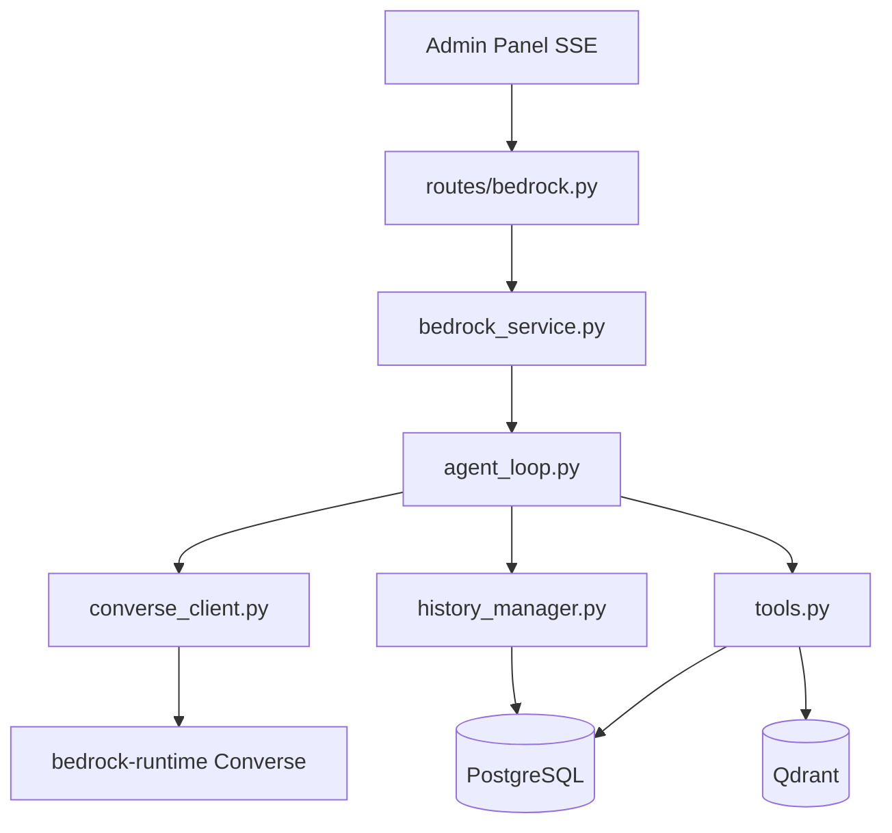

# Agent Bedrock — Harness Converse

Asistente IA del Admin Panel: chat con tool calling, memoria, presupuesto y auditoría.

**Prefijo:** `/bedrock`  
**Tag OpenAPI:** `Bedrock`  
**Auth:** JWT requerido (mismo scope que Admin Panel) — [sections/auth](../auth/README.md)

Índice de docs API: [docs/README.md](../../README.md). Implementación del harness: [src/services/bedrock/README.md](../../../src/services/bedrock/README.md).

---

## Arquitectura



Inferencia vía API **Converse** de `bedrock-runtime` (ADR-008).

Paquete interno: [`src/services/bedrock/README.md`](../../../src/services/bedrock/README.md) — qué recibe y qué entrega cada módulo y cada función (paquete → archivo → `chat_stream`, etc.).

---

## Configuración

| Variable | Default | Descripción |
|----------|---------|-------------|
| `BEDROCK_REGION` | `us-east-1` | Región AWS |
| `BEDROCK_DEFAULT_MODEL_ID` | Claude Haiku 4.5 | Modelo contextual default |
| `BEDROCK_ORCHESTRATOR_MODEL_ID` | Nova Pro | Modelo del orquestador |
| `BEDROCK_DAILY_BUDGET_USD` | `5.0` | Tope diario por usuario |
| `BEDROCK_MAX_ROUND_TRIPS` | `6` | Vueltas tool-use por turno |
| `BEDROCK_HISTORY_WINDOW` | `20` | Mensajes en contexto |
| `AWS_ACCESS_KEY_ID` / `SECRET` | — | Credenciales IAM |

IAM requerido: `bedrock:InvokeModel` (+ opcional `InvokeModelWithResponseStream`). Ver [BEDROCK-HARNESS.md](../../BEDROCK-HARNESS.md#iam).

---

## Chat (SSE)

### POST /bedrock/chat

**Content-Type respuesta:** `text/event-stream`

**Request body (`BedrockChatRequest`):**

```json
{
  "session_id": "uuid-v4",
  "message": "Lista mis vacantes pendientes",
  "chat_surface": "contextual",
  "page_context": {
    "route": "/career/vacancies",
    "resource_key": "vacancies",
    "page_title": "Vacantes"
  },
  "model_id": "us.anthropic.claude-haiku-4-5-20251001-v1:0",
  "agent_profile_id": null,
  "attachments": null
}
```

| Campo | Valores | Descripción |
|-------|---------|-------------|
| `chat_surface` | `contextual` \| `general` | Sidebar vs `/agent/chat` |
| `page_context` | objeto \| null | Solo en contextual |
| `model_id` | allow-list | Override de modelo |
| `agent_profile_id` | perfil ID | Override de agente (contextual) |

**Eventos SSE:**

| type | Descripción |
|------|-------------|
| `status` | Progreso ("Buscando registros...") |
| `delegation_start` | Orquestador delega a especialista |
| `delegation_end` | Especialista terminó |
| `done` | `{ reply, affected_resources }` |
| `error` | `{ message }` |

**Flujo interno (`agent_loop.py`):**
1. Verificar presupuesto diario
2. Resolver perfil de agente y modelo
3. Componer system prompt
4. Cargar historial PG (ventana N mensajes)
5. Loop Converse → tool use → ejecutar tools → repetir
6. Persistir mensajes y usage logs

---

## Modelos

| Método | Path | Descripción |
|--------|------|-------------|
| `GET` | `/bedrock/model` | Modelo activo + catálogo allow-list |
| `POST` | `/bedrock/model` | Cambiar modelo activo (persiste en PG) |

10 modelos en `config.BEDROCK_AVAILABLE_MODELS` (Nova, Claude, Llama, Mistral, DeepSeek, Cohere).

---

## Presupuesto y métricas

| Método | Path | Descripción |
|--------|------|-------------|
| `GET` | `/bedrock/usage-metrics` | Tokens y costo estimado (`?days=30`) |
| `GET` | `/bedrock/budget` | Gasto hoy vs límite diario |

Bloqueo: si gasto UTC del día ≥ `BEDROCK_DAILY_BUDGET_USD`, el chat retorna error de presupuesto.

---

## Instrucciones y perfiles

| Método | Path | Descripción |
|--------|------|-------------|
| `GET` | `/bedrock/instructions` | System prompt global |
| `PUT` | `/bedrock/instructions` | Override del system prompt |
| `GET` | `/bedrock/agent-profiles` | Lista perfiles + suffix prompts |
| `PUT` | `/bedrock/agent-profiles/{profile_id}/prompt` | Suffix por perfil |
| `GET` | `/bedrock/agent-profiles/catalog` | Catálogo: definición de código + metodologías/memoria |
| `GET` | `/bedrock/agent-profiles/{profile_id}/catalog` | Detalle de un agente |
| `PUT` | `/bedrock/agent-profiles/{profile_id}/methodologies` | Asigna metodologías que el agente consulta |
| `GET` | `/bedrock/agent-profiles/{profile_id}/tools` | Estado de herramientas (default/override/efectivo) |
| `PUT` | `/bedrock/agent-profiles/{profile_id}/tools` | Configura las herramientas que el agente puede usar |
| `GET` | `/bedrock/tools/catalog` | Catálogo read-only de herramientas (integradas + MCP) |
| `GET` | `/bedrock/agent-profiles/{profile_id}/memory` | Memoria propia L1/L2 (notas + conteo de chats) |
| `POST` | `/bedrock/agent-profiles/{profile_id}/memory/notes` | Añade nota de memoria propia |
| `DELETE` | `/bedrock/agent-profiles/{profile_id}/memory/notes/{note_id}` | Elimina una nota |

**Jerarquía de 3 niveles (ADR-012 / ADR-013):** L1 `agent_orchestrator`; L2 `agent_professional_identity`, `agent_search_operations`, `agent_digital_presence`, `agent_networking`, `agent_support`, `agent_methodologies`, `agent_pdf_design`; L3 `agent_pdf_render`, `agent_visual_design`, `agent_changelog`, `agent_task_manager`, `agent_linkedin_publishing`, `agent_vacancy_search`, `agent_cv_writing`, `agent_cover_letter_writing`, `agent_web_search`, `agent_github` (sin chat).

Definidos en `services/bedrock/agent_profiles.py`.

---

## Conversaciones

| Método | Path | Descripción |
|--------|------|-------------|
| `GET` | `/bedrock/conversations` | Listar (`?session_type=general\|contextual` y `?agent_profile_id=agent_professional_identity\|agent_search_operations\|agent_orchestrator\|…`) |
| `GET` | `/bedrock/conversations/{session_id}/messages` | Mensajes de una conversación |
| `PUT` | `/bedrock/conversations/{session_id}` | Renombrar |
| `DELETE` | `/bedrock/conversations/{session_id}` | Eliminar |

Historial en PostgreSQL (`bedrock_conversations`, `bedrock_conversation_messages`). Cada especialista y el orquestador tienen su propia lista: el filtro `agent_profile_id` es coincidencia exacta. Conversaciones contextuales anteriores a este campo quedan con `NULL` y no aparecen en las listas filtradas (sí en Memoria, sin filtro).

---

## Memoria y conocimiento

| Método | Path | Descripción |
|--------|------|-------------|
| `GET` | `/bedrock/knowledge/search` | Búsqueda semántica Qdrant (`?q=&top_k=5`) |
| `GET` | `/bedrock/memory/events` | Eventos de memoria corto plazo (`?session_id=`) |
| `GET` | `/bedrock/memory/records` | Hechos duraderos semánticos (`?query=`) |
| `POST` | `/bedrock/memory/manual` | Indexar hecho manual en Qdrant |
| `POST` | `/bedrock/knowledge-base/reindex` | Reindexa Qdrant desde Postgres y purga huérfanos → `{reindexed, purged_orphans, users}` (síncrono, operador) |

Historial en PostgreSQL; hechos semánticos en Qdrant.

**Consistencia Qdrant ↔ Postgres (ADR-026, reapertura 2026-09-07).** El índice
`career_knowledge` es una copia derivada de Postgres; una migración de ids/`user_id` sin
re-indexar lo deja *stale* (el agente "no encuentra" metodologías/registros). `POST
/bedrock/knowledge-base/reindex` lo reconstruye (idempotente); `scripts/check_kb_consistency.py`
lo audita sin modificar. Correr ambos tras cualquier migración de ese tipo.

---

## Tools MCP custom

| Método | Path | Descripción |
|--------|------|-------------|
| `GET` | `/bedrock/tools` | Listar servidores MCP registrados |
| `POST` | `/bedrock/tools` | Registrar servidor MCP remoto |
| `PUT` | `/bedrock/tools/{tool_id}/enabled` | Activar/desactivar |
| `DELETE` | `/bedrock/tools/{tool_id}` | Eliminar |

Tipo soportado: `remote_mcp`.

---

## Auditoría

| Método | Path | Descripción |
|--------|------|-------------|
| `GET` | `/bedrock/audit-log` | Historial de cambios del agente |
| `POST` | `/bedrock/audit-log/{audit_id}/restore` | Restaurar registro eliminado |

---

## Tools internas (Converse)

Ejecutadas en `services/bedrock/tools.py` → `bedrock_service._execute_tool`:

| Categoría | Tools |
|-----------|-------|
| CRUD carrera | `list/get/create/update/delete_career_record`, `count_career_records` |
| Conocimiento | `search_knowledge_base`, `describe_resource_schema` |
| Auditoría | `list_recent_changes`, `restore_deleted_record` |
| LinkedIn | `get_linkedin_status`, `create_linkedin_post`, … (L3 `agent_linkedin_publishing`) |
| PDF | `pdf_template` / `pdf_style` (L2 `agent_pdf_design`); `generate_pdf` / `render_record_pdf` (L3 `agent_pdf_render`) |
| Imágenes | `generate_image`, `attach_image_to_record` (L3 `agent_visual_design`) |
| Vacantes | `run_job_discovery`, `import_job_url`, `save_job_listings` (L3 `agent_vacancy_search`) |
| Redacción | CRUD `cv-versions` (L3 `agent_cv_writing`); CRUD `cover-letter-versions` (L3 `agent_cover_letter_writing`) |
| Web | `web_search`, `web_fetch` (L3 `agent_web_search`) |
| GitHub | `get_github_status`, `list_github_repos`, `get_github_file`, … (L3 `agent_github`, solo lectura) |
| Delegación | `delegate_to_specialist` (L1→L2|L3, L2→L3) |

---

## Superficies de chat y niveles

| Superficie | UI | Agente | Delegación |
|------------|-----|--------|------------|
| `general` | `/agent/chat` | L1 orquestador (sin CRUD) | Sí, a L2 y L3 |
| `contextual` | Sidebar derecha | L2 de la sección | Sí, solo a L3 |
| — | Ninguna | L3 tarea | No |

---

## Ejemplo curl (SSE)

```bash
curl -N -X POST http://localhost:8001/bedrock/chat \
  -H "Authorization: Bearer $TOKEN" \
  -H "Content-Type: application/json" \
  -d '{
    "session_id": "550e8400-e29b-41d4-a716-446655440000",
    "message": "¿Cuántos logros tengo?",
    "chat_surface": "contextual",
    "page_context": {"resource_key": "achievements", "page_title": "Logros"}
  }'
```

---

## Documentación relacionada

Solo docs y README **dentro de `api/`**.

### Docs

| Documento | Contenido |
|-----------|-----------|
| [docs/README.md](../../README.md) | Índice de documentación de la API |
| [sections/README.md](../README.md) | Índice de secciones HTTP |
| [BEDROCK-HARNESS.md](../../BEDROCK-HARNESS.md) | IAM AWS, Converse, errores frecuentes |
| [SETUP.md](../../SETUP.md) | Variables `BEDROCK_*`, Docker, Alembic |
| [DATABASE.md](../../DATABASE.md) | Tablas `bedrock_*` |
| [ARCHITECTURE.md](../../ARCHITECTURE.md) | Capas Routes → Services |
| [API.md](../../API.md) | Referencia rápida de endpoints |
| [SECURITY.md](../../SECURITY.md) | JWT e aislamiento por `user_id` |
| [TESTING.md](../../TESTING.md) | Pytest y cobertura |
| [TROUBLESHOOTING.md](../../TROUBLESHOOTING.md) | Problemas comunes |

### Implementación (`src/`)

| Paquete | README |
|---------|--------|
| Harness (3 niveles) | [src/services/bedrock/README.md](../../../src/services/bedrock/README.md) |
| Fachada y servicios | [src/services/README.md](../../../src/services/README.md) |
| Router `/bedrock` | [src/routes/README.md](../../../src/routes/README.md) |
| Models / schemas / repos | [models](../../../src/models/README.md) · [schemas](../../../src/schemas/README.md) · [repositories](../../../src/repositories/README.md) |
| Tests del harness | [tests/unit/bedrock](../../../tests/unit/bedrock/README.md) |

### Secciones HTTP vecinas

| Sección | README |
|---------|--------|
| Tareas programables | [bedrock-tasks](../bedrock-tasks/README.md) |
| Auth JWT | [auth](../auth/README.md) |
| CRUD, Qdrant, IDs | [infrastructure](../infrastructure/README.md) |
| Identidad / proyectos | [career-identity](../career-identity/README.md) |
| Vacantes / CVs | [career-search](../career-search/README.md) |
| Publicaciones / portal | [career-digital](../career-digital/README.md) |
| Job discovery | [job-discovery](../job-discovery/README.md) |
| Plantillas PDF | [pdf-templates](../pdf-templates/README.md) |
| Estilos PDF | [pdf-template-styles](../pdf-template-styles/README.md) |
| MinIO / `file_id` | [files](../files/README.md) |
| LinkedIn | [linkedin](../linkedin/README.md) |
