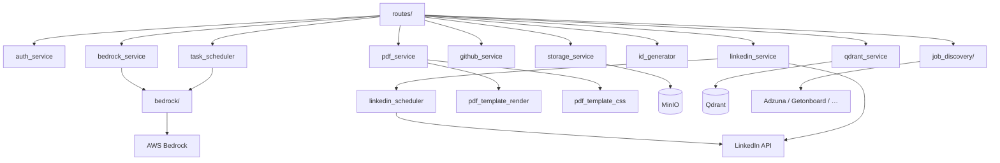

# Paquete `services/`

Lógica de negocio e integraciones externas. Las rutas no hablan con AWS, MinIO, LinkedIn ni Qdrant directamente: pasan por estos módulos.

## Arquitectura

---

## Subpaquetes

| Paquete | README |
|---------|--------|
| `bedrock/` | [bedrock/README.md](bedrock/README.md) — harness Converse: guía en 3 niveles (paquete → módulo → función) con recibe/entrega, ejemplo y diagrama |
| `job_discovery/` | [job_discovery/README.md](job_discovery/README.md) — adaptadores de vacantes y preview-then-save |

---

## Módulos

### `auth_service.py` — JWT y contraseñas

`AuthService` (SRP: solo autenticación).

| Método | Función |
|--------|---------|
| `hash_password` / `verify_password` | bcrypt, tope 72 bytes |
| `create_access_token` / `create_refresh_token` | JWT HS256 con expiración de `settings` |
| `decode_access_token` / `decode_refresh_token` | Valida tipo de token y firma |
| `extract_user_id_from_token` | `sub` del payload |

Usado por `middleware.auth` y `routes.auth_enhanced`.

### `bedrock_service.py` — Fachada del agente

El loop de chat vive en `services/bedrock/` ([guía por módulo](bedrock/README.md)). Este módulo conserva:

- Tools CRUD de carrera (`_execute_tool` + `RESOURCE_REGISTRY`).
- Bitácora / restore de deletes.
- Conversaciones PG y embeddings Titan usados por el harness y por `CareerRepository` al indexar.

`BedrockError` se traduce a HTTP 502/503 en las rutas.

### `id_generator.py` — IDs prefijados

Formato `{prefijo}-{n}` (`ach-17`, `vac-5`, `usr-1`). `TABLE_PREFIXES` es la fuente de verdad tabla → prefijo.

| Función | Uso |
|---------|-----|
| `register_id_listener(Model, prefix)` | Sequence PostgreSQL + listener `before_insert` |
| `normalize_prefixed_id` | Acepta `17` o `ach-17` y devuelve el ID canónico |
| `prefix_for_key` | Prefijo por `resource_key` |

Cada modelo de carrera llama `register_id_listener` al importarse.

### `storage_service.py` — MinIO

I/O de bucket S3-compatible. Sin acceso a BD.

`ensure_bucket`, `upload_file`, `set_visibility` (mueve entre `public/` y `private/`), `delete_file`, `get_public_url`, `get_presigned_url`, `get_object_stream`. Tráfico interno sin TLS; HTTPS lo termina Caddy.

### `qdrant_service.py` — Búsqueda semántica

Colección de vectores Titan. `upsert_point` / `delete_point` / `set_point_payload` (id determinista `resource_key` + `record_id`), `search` por embedding. `CareerRepository` indexa en background tras create/update/delete si `vectorize=True`. Metodologías llevan `agent_profile_ids` en el payload.

### `pdf_service.py` — Generación PDF (WeasyPrint in-process)

`generate_markdown_document` y `generate_html_template_pdf` → bytes PDF. WeasyPrint corre en un `ProcessPoolExecutor` (fork en Linux) para que un crash nativo no tumbe uvicorn. Timeout 60 s. `PDFGeneratorError` si falla el render.

### `pdf_template_render.py`

Sustitución `{{variable}}` en HTML de plantillas antes de WeasyPrint.

### `pdf_template_css.py`

`resolve_template_css`: lee `PdfTemplateStyle` por `style_id` de la plantilla (activo).

### `methodology_scope.py`

`applies_to_agent(agent_profile_ids, caller_id)`: lista vacía = todos; `agent_methodologies` ve todas. Usado al filtrar `search_knowledge_base` type=methodology y al armar el catálogo del system prompt.

`list_assigned_methodologies(db, user_id, caller_id)`: títulos vigentes asignados al agente (Admin → Agentes). Se inyecta cada turno en `compose_system_prompt` para que una metodología nueva asignada se asuma sin cambiar código.

`set_agent_methodologies(db, user_id, profile_id, ids)`: asigna desde el catálogo de agentes (Admin). Vacío = compartida; al quitar el último dueño se aparca en `agent_methodologies`. Tras persistir, **fuerza el reindex** de todas las metodologías del usuario en Qdrant (awaited) aunque `agent_profile_ids` no cambie — el catálogo del prompt ya sale de PG, pero `search_knowledge_base` lee del índice y este puede haber driftado (spec 003, RF-014). Ver `bedrock/knowledge_base.py`.

### `github_service.py`

Lista repos públicos de un username (`GET api.github.com/users/{u}/repos`) para el Admin. Con `GITHUB_TOKEN`, el L3 `agent_github` lee repos (incl. privados), archivos y `search/code`. `GitHubError` en 404, 401 o rate limit. No escribe (issues/PRs/push).

### `web_search_service.py`

Consulta web del L3 `agent_web_search`: `search` (Brave si hay `BRAVE_SEARCH_API_KEY`, si no DuckDuckGo HTML) y `fetch` de URLs públicas con bloqueo SSRF. No toca PostgreSQL.

### `linkedin_service.py` — OAuth y Posts API

| Función | Uso |
|---------|-----|
| `build_state_token` / `decode_state_token` | Firma el `user_id` para el callback |
| `build_authorize_url` | Redirect OAuth “Share on LinkedIn” |
| `exchange_code_for_token` | Token de acceso |
| `fetch_userinfo` | Nombre, email, foto |
| `upload_image` / `create_post` | Imagen + UGC post |

LinkedIn no programa posts: `scheduled_at` lo cumple `linkedin_scheduler`.

### `linkedin_scheduler.py`

Task asyncio en el lifespan de `app.py`. Cada 60 s publica filas `linkedin_posts` con `status=scheduled` y `scheduled_at <= now`. Un solo worker uvicorn → sin carrera entre procesos.

### `task_scheduler.py`

Task asyncio en el mismo lifespan. Cada 30 s reclama `bedrock_tasks` con `assignee_type=agent`, `status=pending` y `scheduled_at <= now`, e invoca `run_single_turn_sync` (ADR-015). `POST /agent-tasks/{id}/run` usa el mismo runner.

### `__init__.py`

Vacío. Los consumidores importan módulos concretos (`from services import storage_service`).
