# Paquete `services/bedrock/`

Harness local del Agent Bedrock del Admin Panel: loop Converse con tool calling, historial en PostgreSQL, presupuesto diario, delegación a especialistas y memoria semántica en Qdrant.

**Punto de entrada público:** `chat_stream` (exportado en `__init__.py`).

Este README documenta **el harness interno**. Los enlaces apuntan solo a docs y README **dentro de `api/`** (como si este módulo fuera un proyecto independiente). Índice de docs: [docs/README.md](../../../docs/README.md).

| Capa | Destino |
|------|---------|
| Índice de docs API | [docs/README.md](../../../docs/README.md) |
| Contrato HTTP del agente | [sections/bedrock](../../../docs/sections/bedrock/README.md) |
| IAM, errores AWS, catálogo de modelos | [BEDROCK-HARNESS.md](../../../docs/BEDROCK-HARNESS.md) |
| Índice de secciones HTTP | [docs/sections](../../../docs/sections/README.md) |
| README del módulo API | [api/README.md](../../../README.md) |

---

## Cómo leer este documento

Tres niveles, el mismo patrón en cada uno: **qué es → qué recibe → qué entrega → ejemplo → diagrama**.

| Nivel | Unidad | Ejemplo |
|-------|--------|---------|
| **1** | El paquete completo | `services/bedrock/` |
| **2** | Un archivo-módulo | `agent_loop.py` |
| **3** | Una función / tipo público | `chat_stream` |

El historial **no viaja en la petición HTTP**. El cliente manda solo el mensaje nuevo; PostgreSQL es la fuente de verdad del chat.

---

## Navegación en el módulo API

Docs y README **dentro de `api/`** que este paquete usa pero no sustituye. Si el harness toca un dominio, la semántica HTTP y el esquema viven allá.

### Agente

| Tema | README |
|------|--------|
| Endpoints `/bedrock` (SSE, modelo, presupuesto, memoria, auditoría, dos superficies) | [sections/bedrock](../../../docs/sections/bedrock/README.md) |
| Router FastAPI `routes/bedrock.py` | [src/routes/README.md](../../routes/README.md) |
| Fachada `bedrock_service.py` (CRUD career tools, bitácora) | [src/services/README.md](../README.md) |
| Tareas programables del agente | [sections/bedrock-tasks](../../../docs/sections/bedrock-tasks/README.md) |
| Tests unitarios del harness | [tests/unit/bedrock](../../../tests/unit/bedrock/README.md) |

### Acceso, persistencia e infraestructura

| Tema | README |
|------|--------|
| Login, JWT, refresh | [sections/auth](../../../docs/sections/auth/README.md) |
| Middleware JWT, factory CRUD, repos, IDs, Qdrant | [sections/infrastructure](../../../docs/sections/infrastructure/README.md) |
| Middleware `get_current_user` | [src/middleware/README.md](../../middleware/README.md) |
| Modelos ORM (conversaciones, usage, settings) | [src/models/README.md](../../models/README.md) |
| `CareerRepository` | [src/repositories/README.md](../../repositories/README.md) |
| Schemas Pydantic | [src/schemas/README.md](../../schemas/README.md) |
| Esquema PostgreSQL | [DATABASE.md](../../../docs/DATABASE.md) |
| Arquitectura del módulo API | [ARCHITECTURE.md](../../../docs/ARCHITECTURE.md) · [src/README.md](../../README.md) |
| Referencia de endpoints | [API.md](../../../docs/API.md) |
| JWT, aislamiento, CORS | [SECURITY.md](../../../docs/SECURITY.md) |
| Variables de entorno / setup | [SETUP.md](../../../docs/SETUP.md) |
| Pytest y cobertura | [TESTING.md](../../../docs/TESTING.md) · [tests/README.md](../../../tests/README.md) |
| Problemas comunes | [TROUBLESHOOTING.md](../../../docs/TROUBLESHOOTING.md) |

### Dominio que ejecutan las tools

| Tema | README |
|------|--------|
| Identidad, competencias, logros, **proyectos**… | [sections/career-identity](../../../docs/sections/career-identity/README.md) |
| Vacantes, aplicaciones, CVs, entrevistas | [sections/career-search](../../../docs/sections/career-search/README.md) |
| Publicaciones, portal, perfiles sociales | [sections/career-digital](../../../docs/sections/career-digital/README.md) |
| Etiquetas | [sections/career-support](../../../docs/sections/career-support/README.md) |
| Metodologías operativas | [sections/career-methodologies](../../../docs/sections/career-methodologies/README.md) |
| Métricas de búsqueda (solo lectura) | [sections/career-metrics](../../../docs/sections/career-metrics/README.md) |
| Job discovery HTTP (preview → save) | [sections/job-discovery](../../../docs/sections/job-discovery/README.md) |
| Adaptadores de portales | [services/job_discovery](../job_discovery/README.md) |
| Plantillas HTML → PDF | [sections/pdf-templates](../../../docs/sections/pdf-templates/README.md) |
| Estilos CSS PDF | [sections/pdf-template-styles](../../../docs/sections/pdf-template-styles/README.md) |
| Upload MinIO, `file_id`, URLs | [sections/files](../../../docs/sections/files/README.md) |
| OAuth y posts LinkedIn | [sections/linkedin](../../../docs/sections/linkedin/README.md) |
| Portafolio público (lectura) | [sections/public](../../../docs/sections/public/README.md) |

---

## Índice

- [Navegación en el módulo API](#navegación-en-el-módulo-api)
- [Nivel 1 — Paquete `services/bedrock/`](#nivel-1--paquete-servicesbedrock)
- [Nivel 2 — `agent_loop.py`](#nivel-2--agent_looppy)
- [Nivel 2 — `converse_client.py`](#nivel-2--converse_clientpy)
- [Nivel 2 — `tools.py`](#nivel-2--toolspy)
- [Nivel 2 — `history_manager.py`](#nivel-2--history_managerpy)
- [Nivel 2 — `agent_profiles.py`](#nivel-2--agent_profilespy)
- [Nivel 2 — `section_profiles.py`](#nivel-2--section_profilespy)
- [Nivel 2 — `delegation.py`](#nivel-2--delegationpy)
- [Nivel 2 — `budget.py`](#nivel-2--budgetpy)
- [Nivel 2 — `usage_logger.py`](#nivel-2--usage_loggerpy)
- [Nivel 2 — `prompt.py`](#nivel-2--promptpy)
- [Nivel 2 — `profile_prompts.py`](#nivel-2--profile_promptspy)
- [Nivel 2 — `settings_loader.py`](#nivel-2--settings_loaderpy)
- [Nivel 2 — `attachments.py`](#nivel-2--attachmentspy)
- [Nivel 2 — `image_client.py`](#nivel-2--image_clientpy)
- [Nivel 2 — `embeddings.py`](#nivel-2--embeddingspy)
- [Nivel 2 — `local_memory.py`](#nivel-2--local_memorypy)
- [Nivel 2 — `reply_text.py`](#nivel-2--reply_textpy)
- [Nivel 2 — `tool_results.py`](#nivel-2--tool_resultspy)
- [Nivel 2 — `errors.py`](#nivel-2--errorspy)
- [Nivel 2 — `__init__.py`](#nivel-2--__init__py)

---

# Nivel 1 — Paquete `services/bedrock/`

Motor del asistente IA del Admin Panel. No es un servidor HTTP propio: la ruta FastAPI [`POST /bedrock/chat`](../../../docs/sections/bedrock/README.md) traduce JSON + [JWT](../../../docs/sections/auth/README.md) a un `ChatTurnRequest`, llama a este paquete y serializa sus eventos como SSE (`data: {...}\n\n`). Router: [`routes/bedrock.py`](../../routes/README.md).

El paquete orquesta una jerarquía de 3 niveles (ADR-012): presupuesto → perfil (L1/L2/L3) → prompt → historial (solo L1/L2) → Converse (AWS) → tools o `delegate_to_specialist` → respuesta. L1 no hace CRUD. L3 no tiene chat. AWS Bedrock nunca toca la base de datos; las tools sí, siempre filtradas por `user_id` ([aislamiento](../../../docs/sections/infrastructure/README.md)).

### Recibe

| Campo | Origen | Qué es |
|-------|--------|--------|
| `user_id` | [JWT](../../../docs/sections/auth/README.md) (`get_current_user`, [middleware](../../middleware/README.md)) | Dueño de datos e historial |
| `session_id` | body JSON ([BedrockChatRequest](../../../docs/sections/bedrock/README.md)) | Clave de conversación en PG |
| `message` | body JSON | Solo el turno actual |
| `chat_surface` | body | `contextual` (sidebar) o `general` (`/agent/chat`) — [dos superficies](../../../docs/sections/bedrock/README.md) |
| `page_context` | body | Ruta / `resource_key` de la página Admin |
| `model_id` | body opcional | Override de modelo ([allow-list](../../../docs/BEDROCK-HARNESS.md)) |
| `agent_profile_id` | body opcional | Override de especialista ([perfiles](../../../docs/sections/bedrock/README.md)) |
| `attachments` | body opcional | `[{file_id}]` ya subidos a [MinIO](../../../docs/sections/files/README.md) |

### Entrega

Un **stream de eventos** (no un JSON único). La ruta los envuelve en SSE.

| `type` | Cuándo | Payload |
|--------|--------|---------|
| `status` | Progreso | `{message}` — p. ej. `"Buscando registros..."` |
| `delegation_start` / `delegation_end` | Chat general | Perfil, preview de tarea / resumen |
| `done` | Éxito | `{reply, affected_resources}` |
| `error` | Fallo de inferencia, presupuesto o max rounds | `{message}` |

HTTP es **200 + `text/event-stream`** salvo auth/config (401/503; ver [auth](../../../docs/sections/auth/README.md) y [chat SSE](../../../docs/sections/bedrock/README.md)). El éxito o el error van *dentro* del stream.

### Ejemplo

**Solicitud HTTP** ([`POST /bedrock/chat`](../../../docs/sections/bedrock/README.md)):

```http
POST /bedrock/chat
Authorization: Bearer <jwt>
Content-Type: application/json
```

```json
{
  "session_id": "conv-proyectos-01",
  "message": "Lista mis proyectos publicados",
  "chat_surface": "contextual",
  "page_context": {
    "route": "/career/projects",
    "resource_key": "projects",
    "page_title": "Proyectos"
  },
  "model_id": "amazon.nova-pro-v1:0",
  "agent_profile_id": null,
  "attachments": null
}
```

**Respuesta SSE favorable (turno con tool):**

```
data: {"type": "status", "message": "Pensando..."}

data: {"type": "status", "message": "Buscando registros..."}

data: {"type": "done", "reply": "Tienes 3 proyectos:\n1. Portafolio\n2. API REST\n3. Admin Panel", "affected_resources": ["projects"]}
```

**Respuesta SSE con error:**

```
data: {"type": "status", "message": "Pensando..."}

data: {"type": "error", "message": "Presupuesto diario agotado ($5.00 / $5.00). Ajusta BEDROCK_DAILY_BUDGET_USD o espera mañana."}
```

El cliente del Admin consume el SSE y resuelve `{ reply, affected_resources }` o lanza con `event.message` (contrato en [sections/bedrock](../../../docs/sections/bedrock/README.md)).

### Flujo

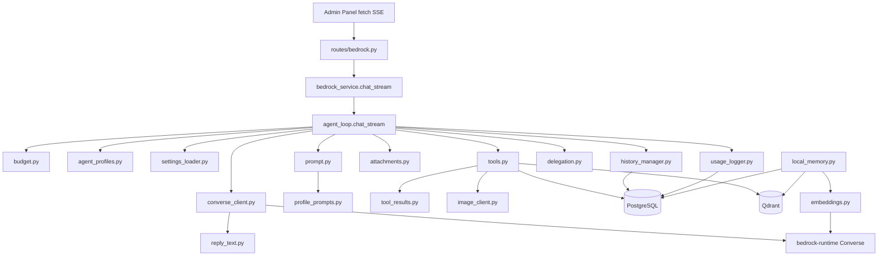
```mermaid
flowchart TB
    Admin[Admin Panel fetch SSE] --> Route["routes/bedrock.py"]
    Route --> Facade["bedrock_service.chat_stream"]
    Facade --> Loop["agent_loop.chat_stream"]
    Loop --> Budget[budget.py]
    Loop --> Profiles[agent_profiles.py]
    Loop --> Settings[settings_loader.py]
    Loop --> Prompt[prompt.py]
    Loop --> History[history_manager.py]
    Loop --> Attach[attachments.py]
    Loop --> Converse[converse_client.py]
    Loop --> Tools[tools.py]
    Loop --> Deleg[delegation.py]
    Loop --> Usage[usage_logger.py]
    Prompt --> Suffix[profile_prompts.py]
    Converse --> Reply[reply_text.py]
    Converse --> AWS[bedrock-runtime Converse]
    Tools --> Trunc[tool_results.py]
    Tools --> Img[image_client.py]
    Tools --> PG[(PostgreSQL)]
    Tools --> Qdrant[(Qdrant)]
    History --> PG
    Usage --> PG
    Memory[local_memory.py] --> Emb[embeddings.py]
    Emb --> AWS
    Memory --> PG
    Memory --> Qdrant
```

Orden de un turno:

1. `budget.assert_budget_available`
2. `section_catalog.resolve_profile_for_turn` — `general` → orquestador; `contextual` →
   el agente **L2** asignado a la sección de la ruta en el catálogo de Secciones del
   Admin (`admin_section_overrides` / registro de código), y si la sección no tiene
   agente o la ruta no hace match con ninguna sección, degrada al orquestador. Un
   `agent_profile_id` explícito en la request gana. (feature 001: se retiró la
   derivación `chat_agent_id()` / `_L3_CHAT_FALLBACK`; `resolve_agent_profile` sigue
   como router de biblioteca para `general` y usos internos.)
3. `settings_loader` + `section_profiles` (modelo)
4. `prompt.compose_system_prompt`
5. `history_manager.load_converse_messages`
6. `attachments.build_user_content_blocks`
7. Loop: `converse_client.converse` → `tools.execute_tool` → repetir
8. `usage_logger.record_*` + `history_manager.append_message`

Contrato HTTP del mismo flujo: [sections/bedrock — Chat (SSE)](../../../docs/sections/bedrock/README.md). Tests: [tests/unit/bedrock](../../../tests/unit/bedrock/README.md).

---

# Nivel 2 — `agent_loop.py`

Orquestador del turno y de la jerarquía L1/L2/L3. No llama a AWS ni a PostgreSQL CRUD por sí mismo: coordina al resto de módulos y **emite eventos**. Es el único sitio que conoce el ciclo completo Converse ↔ tools y que valida `delegate_to_specialist` (nivel del caller, profundidad máxima 2, destinos permitidos).

**Lee también:** [contrato SSE](../../../docs/sections/bedrock/README.md) · [fachada `bedrock_service`](../README.md) · [router](../../routes/README.md)

Dos modos de salida:

- **Streaming** (`chat_stream`): generador async para SSE.
- **Síncrono** (`run_single_turn_sync`): drena el mismo generador y devuelve el `done`. Lo usa `delegation.py`.

### Recibe

`db` (sesión async), `user_id` y un `ChatTurnRequest` (mensaje + contexto). Opcional: `max_round_trips_override`, `record_history`.

### Entrega

Eventos `{type, ...}` (`status`, `delegation_*`, `done`, `error`). En modo sync, un dict `done` o `BedrockError`.

### Ejemplo

Ver [Nivel 3 — `chat_stream`](#nivel-3--chat_stream). El wrapper de servicio hace:

```python
async for event in harness_chat_stream(db, user_id, req):
    yield event
```

### Flujo

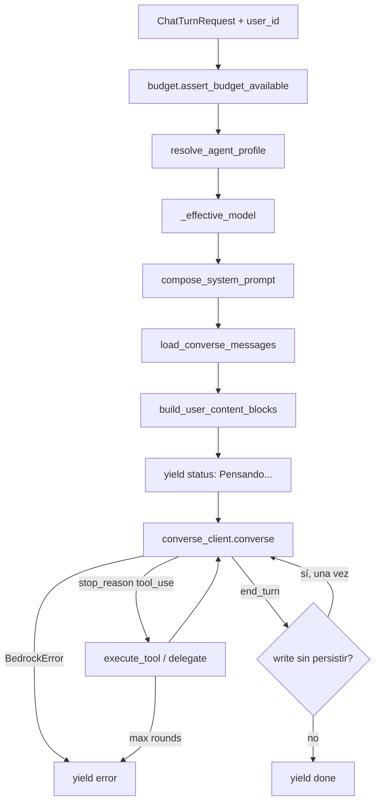
```mermaid
flowchart TD
    IN[ChatTurnRequest + user_id] --> BUD[budget.assert_budget_available]
    BUD --> PROF[resolve_agent_profile]
    PROF --> MOD[_effective_model]
    MOD --> SYS[compose_system_prompt]
    SYS --> HIST[load_converse_messages]
    HIST --> ATT[build_user_content_blocks]
    ATT --> ST["yield status: Pensando..."]
    ST --> CV[converse_client.converse]
    CV -->|stop_reason tool_use| TOOL[execute_tool / delegate]
    TOOL --> CV
    CV -->|end_turn| NUDGE{write sin persistir?}
    NUDGE -->|sí, una vez| CV
    NUDGE -->|no| DONE["yield done"]
    CV -->|BedrockError| ERR["yield error"]
    TOOL -->|max rounds| ERR
```

Si un L2 cierra el turno anunciando un write (p. ej. «Ahora actualizo opm-57») o el usuario pidió guardar / procede y no hubo tool de escritura, `should_nudge_persist` inyecta un recordatorio y vuelve a `converse` con `force_tool_use=True` (una sola vez). Un «ok» no basta salvo que el asistente haya reivindicado el write en ese turno.

---

## Nivel 3 — `ChatTurnRequest`

Dataclass del turno. Es el contrato interno entre la ruta HTTP y el harness.

### Recibe

Campos del body `BedrockChatRequest` (mismos nombres).

| Campo | Default | Rol |
|-------|---------|-----|
| `session_id` | — | Clave de conversación |
| `message` | — | Texto del usuario |
| `chat_surface` | `"contextual"` | Sidebar vs chat general |
| `page_context` | `None` | Ruta / recurso de la página |
| `model_id` | `None` | Override de modelo |
| `agent_profile_id` | `None` | Override de especialista |
| `attachments` | `None` | Lista `{file_id}` |

### Entrega

El objeto en sí; no transforma datos. `user_id` **no** está aquí (lo pasa el loop por separado, desde JWT).

### Ejemplo

```python
ChatTurnRequest(
    session_id="conv-proyectos-01",
    message="Lista mis proyectos publicados",
    chat_surface="contextual",
    page_context={"resource_key": "projects", "page_title": "Proyectos"},
    model_id="amazon.nova-pro-v1:0",
)
```

### Flujo

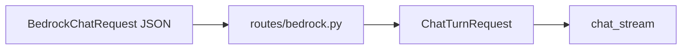
```mermaid
flowchart LR
    HTTP[BedrockChatRequest JSON] --> MAP[routes/bedrock.py]
    MAP --> DTO[ChatTurnRequest]
    DTO --> LOOP[chat_stream]
```

---

## Nivel 3 — `_effective_model`

Elige el `model_id` real enviado a AWS.

Reglas:

- Chat **general**: ignora modelos débiles (Nova Lite/Micro); usa `profile.default_model_id` o `runtime.orchestrator_model_id`.
- Chat **contextual**: usa `req.model_id` si está en allow-list y no es débil; si no, default del perfil; si no, `section_profiles.resolve_recommended_model`.

### Recibe

`req: ChatTurnRequest`, `runtime: HarnessRuntimeSettings`, `profile: AgentProfile`.

### Entrega

`str` — ID de modelo AWS, p. ej. `"amazon.nova-pro-v1:0"`.

### Ejemplo

Contextual en Proyectos, cliente pide Nova Pro → `"amazon.nova-pro-v1:0"`.  
General, cliente pide Nova Lite → se descarta y se usa el del orquestador.

### Flujo

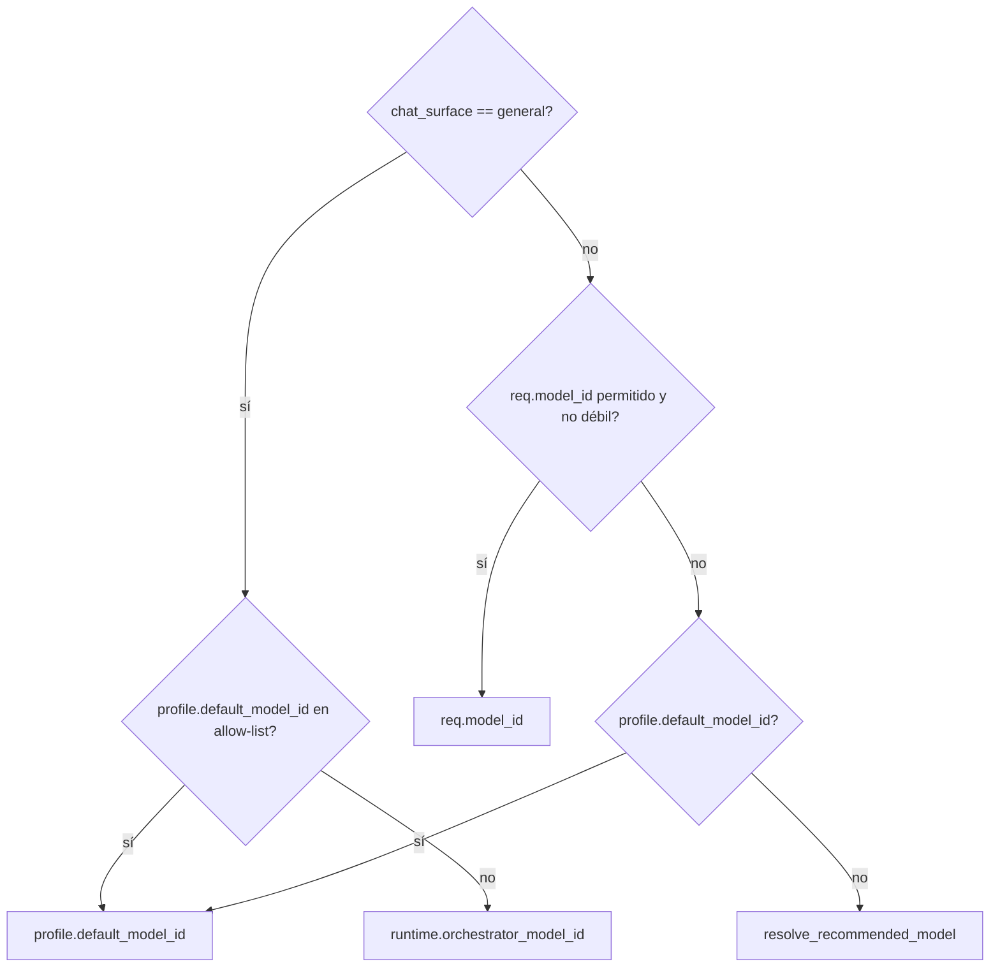
```mermaid
flowchart TD
    A{chat_surface == general?} -->|sí| B{profile.default_model_id en allow-list?}
    B -->|sí| P[profile.default_model_id]
    B -->|no| O[runtime.orchestrator_model_id]
    A -->|no| C{req.model_id permitido y no débil?}
    C -->|sí| R[req.model_id]
    C -->|no| D{profile.default_model_id?}
    D -->|sí| P
    D -->|no| S[resolve_recommended_model]
```

---

## Nivel 3 — `run_single_turn_sync`

Turno **sin SSE**. Itera `chat_stream`, guarda el `done` y convierte `error` en `BedrockError`. Lo usa `delegation.run_specialist_sub_turn`.

### Recibe

`db`, `user_id`, `session_id`, `message`, y los mismos opcionales que el request (`chat_surface`, `agent_profile_id`, `page_context`, `model_id`, `max_round_trips`, `record_history`).

### Entrega

Dict del evento `done`: `{type, reply, affected_resources}`. Si el stream emite `error`, lanza `BedrockError`.

### Ejemplo

Delegación interna (historial apagado, máx. 4 vueltas):

```python
result = await run_single_turn_sync(
    db, user_id=uid, session_id=sid, message="Lista proyectos publicados",
    chat_surface="contextual", agent_profile_id="agent_digital_presence",
    max_round_trips=4, record_history=False,
)
# {"type": "done", "reply": "Tienes 3 proyectos...", "affected_resources": ["projects"]}
```

### Flujo

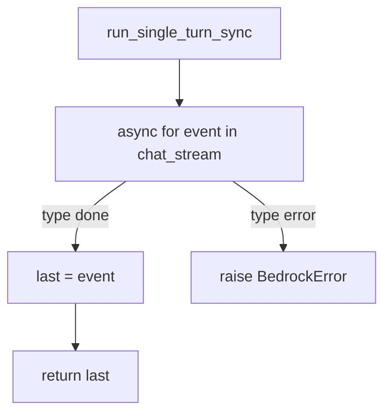
```mermaid
flowchart TD
    A[run_single_turn_sync] --> B[async for event in chat_stream]
    B -->|type done| C[last = event]
    B -->|type error| D[raise BedrockError]
    C --> E[return last]
```

---

## Nivel 3 — `chat_stream`

Generador async del turno. Punto de entrada público del paquete.

### Recibe

```text
db, user_id, req: ChatTurnRequest
max_round_trips_override: int | None = None
record_history: bool = True
```

### Entrega

`AsyncIterator[dict]`:

```python
{"type": "status", "message": "Pensando..."}
{"type": "status", "message": "Buscando registros..."}
{"type": "delegation_start", "agent_profile_id": "agent_digital_presence", "label": "...", "task_preview": "..."}
{"type": "delegation_end", "agent_profile_id": "agent_digital_presence", "success": True, "summary_preview": "..."}
{"type": "done", "reply": "...", "affected_resources": ["projects"]}
{"type": "error", "message": "..."}
```

Un fallo de **tool** no cierra el turno: se reinyecta como `toolResult` `status=error` y Converse sigue. `type: error` es para IAM, modelo, presupuesto (vía excepción atrapada en la ruta) o vueltas agotadas.

### Ejemplo

Misma petición del Nivel 1. Internamente, vuelta 1 (`force_tool_use=True`) → `list_career_record` → PostgreSQL; vuelta 2 → texto final → `done`.

### Flujo

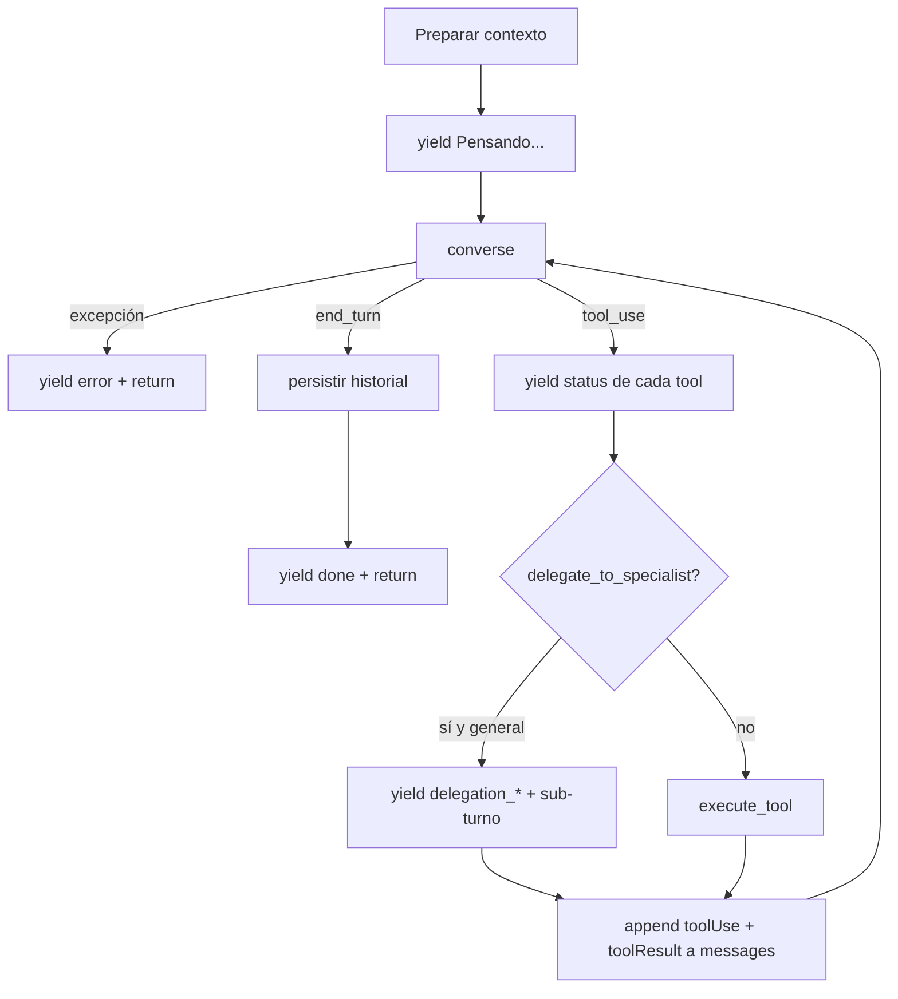
```mermaid
flowchart TD
    A[Preparar contexto] --> B["yield Pensando..."]
    B --> C[converse]
    C -->|excepción| E["yield error + return"]
    C -->|end_turn| D[persistir historial]
    D --> F["yield done + return"]
    C -->|tool_use| G["yield status de cada tool"]
    G --> H{delegate_to_specialist?}
    H -->|sí y general| I["yield delegation_* + sub-turno"]
    H -->|no| J[execute_tool]
    I --> K[append toolUse + toolResult a messages]
    J --> K
    K --> C
```

---

# Nivel 2 — `converse_client.py`

Única puerta a **AWS Bedrock Runtime** para chat. Envuelve `converse` / `converse_stream`, normaliza la respuesta al formato del harness y traduce errores boto3 a `BedrockError`.

**Lee también:** [IAM y errores AWS](../../../docs/BEDROCK-HARNESS.md)

No conoce tools de negocio ni PostgreSQL: recibe `messages` + `toolConfig` ya armados.

### Recibe

`model_id`, `messages` (historial Converse), `system_prompt`, `tools` (schemas), `force_tool_use`, `max_tokens`.

### Entrega

Dict uniforme:

```python
{
  "text": str,           # ya pasado por sanitize_assistant_reply
  "stop_reason": str,    # "tool_use" | "end_turn" | ...
  "usage": {"inputTokens": int, "outputTokens": int},
  "tool_uses": [{"toolUseId", "name", "input"}, ...],
}
```

### Ejemplo

**Hacia AWS:** `modelId`, `system`, `messages`, `toolConfig` (si hay tools; `toolChoice: {any: {}}` si `force_tool_use`).  
**Desde AWS (tool-use):** `stop_reason="tool_use"`, `tool_uses=[{name: "list_career_record", input: {resource_key: "projects", limit: 100}}]`.

### Flujo

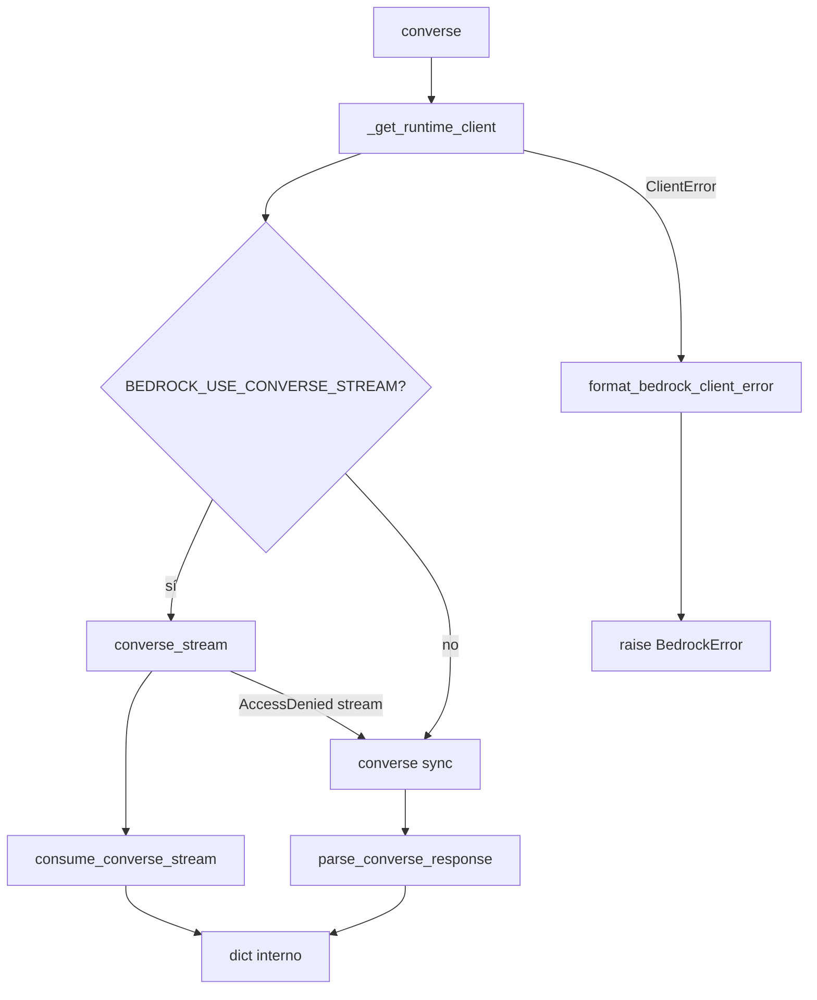
```mermaid
flowchart TD
    IN[converse] --> CLI[_get_runtime_client]
    CLI --> CFG{BEDROCK_USE_CONVERSE_STREAM?}
    CFG -->|sí| ST[converse_stream]
    ST --> CONS[consume_converse_stream]
    CFG -->|no| SY[converse sync]
    SY --> PAR[parse_converse_response]
    ST -->|AccessDenied stream| SY
    CONS --> OUT[dict interno]
    PAR --> OUT
    CLI -->|ClientError| FMT[format_bedrock_client_error]
    FMT --> ERR[raise BedrockError]
```

---

## Nivel 3 — `_get_runtime_client`

Singleton boto3 `bedrock-runtime` con credenciales de `settings`.

### Recibe

Nada (lee `AWS_ACCESS_KEY_ID`, `AWS_SECRET_ACCESS_KEY`, `BEDROCK_REGION`).

### Entrega

Cliente boto3. Sin credenciales → `BedrockError("Missing AWS credentials")`.

### Ejemplo

Primera llamada crea el cliente; las siguientes reutilizan `_runtime_client`.

### Flujo

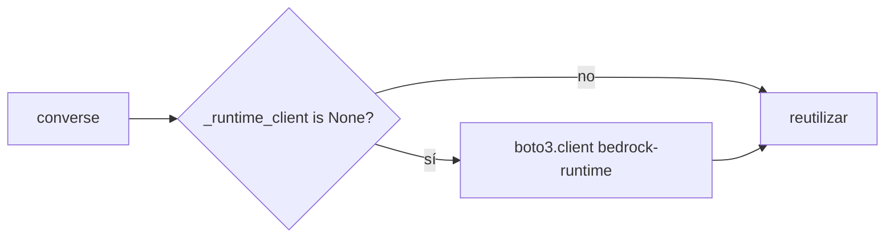
```mermaid
flowchart LR
    A[converse] --> B{_runtime_client is None?}
    B -->|sí| C[boto3.client bedrock-runtime]
    B -->|no| D[reutilizar]
    C --> D
```

---

## Nivel 3 — `parse_converse_response`

Normaliza una respuesta **no streaming** de Converse.

### Recibe

Dict crudo AWS: `output.message.content[]`, `stopReason`, `usage`.

### Entrega

El dict interno (`text`, `stop_reason`, `usage`, `tool_uses`). Ignora `reasoningContent` (thinking interno de Claude/DeepSeek).

### Ejemplo

Bloque AWS `{"toolUse": {"toolUseId": "abc", "name": "list_career_record", "input": {...}}}` → un ítem en `tool_uses`.

### Flujo

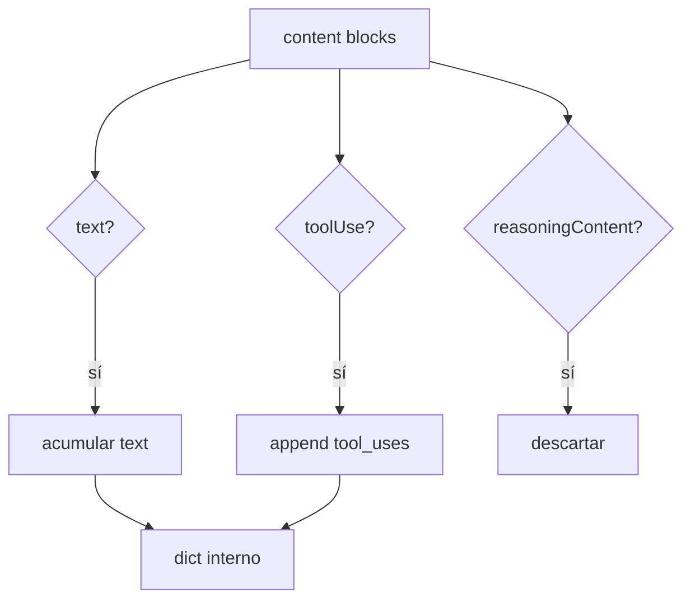
```mermaid
flowchart TD
    A[content blocks] --> B{text?}
    B -->|sí| T[acumular text]
    A --> C{toolUse?}
    C -->|sí| U[append tool_uses]
    A --> D{reasoningContent?}
    D -->|sí| X[descartar]
    T --> OUT[dict interno]
    U --> OUT
```

---

## Nivel 3 — `consume_converse_stream`

Igual que `parse_converse_response`, pero recorre eventos `contentBlockStart` / `Delta` / `messageStop` / `metadata` y parsea el JSON incremental del `input` de cada tool.

### Recibe

Iterador `response["stream"]` de `converse_stream`.

### Entrega

Mismo dict interno. `input` inválido → `{}`.

### Ejemplo

Deltas `"{\"resource_key\":"` + `"\"projects\"}"` → `input = {"resource_key": "projects"}`.

### Flujo

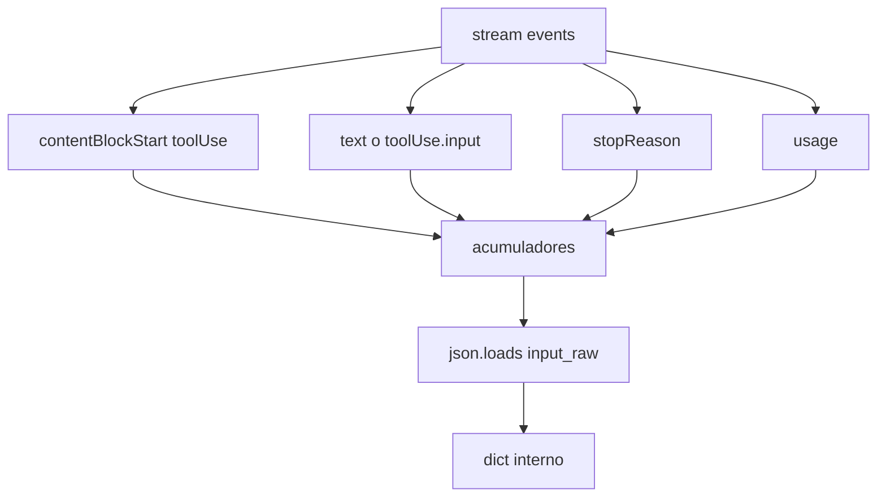
```mermaid
flowchart TD
    S[stream events] --> START[contentBlockStart toolUse]
    S --> DELTA[text o toolUse.input]
    S --> STOP[stopReason]
    S --> META[usage]
    START --> ACC[acumuladores]
    DELTA --> ACC
    STOP --> ACC
    META --> ACC
    ACC --> JSON[json.loads input_raw]
    JSON --> OUT[dict interno]
```

---

## Nivel 3 — `converse`

Una ronda de inferencia. Corre boto3 en thread pool (`asyncio.to_thread`).

### Recibe

Keyword-only: `model_id`, `messages`, `system_prompt`, `tools`, `max_tokens=4096`, `force_tool_use=False`.

### Entrega

Dict interno. Fallos AWS → `BedrockError` con mensaje de `format_bedrock_client_error`. Si el stream falla por IAM, reintenta `converse` síncrono.

### Ejemplo

Primera ronda del loop: `force_tool_use=True` → el modelo **debe** llamar una tool. Segunda ronda: `False` → suele devolver texto y `end_turn`. Si hay persist-nudge, esa ronda extra también va con `force_tool_use=True`.

### Flujo

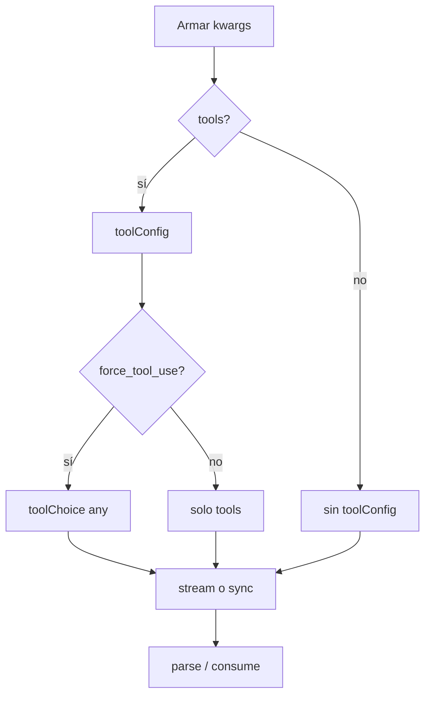
```mermaid
flowchart TD
    A[Armar kwargs] --> B{tools?}
    B -->|sí| C[toolConfig]
    C --> D{force_tool_use?}
    D -->|sí| E["toolChoice any"]
    D -->|no| F[solo tools]
    B -->|no| G[sin toolConfig]
    E --> H[stream o sync]
    F --> H
    G --> H
    H --> I[parse / consume]
```

---

# Nivel 2 — `tools.py`

Catálogo de tools Converse (`_RAW_TOOLS`) y dispatcher. El modelo **no** ejecuta SQL: pide un nombre + JSON; este módulo corre la acción y devuelve un dict que vuelve a Converse como `toolResult`.

**Lee también:** [tools internas en el contrato HTTP](../../../docs/sections/bedrock/README.md) · [fachada `_execute_tool`](../README.md) · [repositorios](../../repositories/README.md)

Dos tiers:

- **Legacy (carrera):** `list/get/create/update/delete_career_record`, `count_career_records`, `search_knowledge_base`, schema, auditoría → `bedrock_service._execute_tool`. Recursos: [identidad/proyectos](../../../docs/sections/career-identity/README.md), [búsqueda/vacantes](../../../docs/sections/career-search/README.md), [digital](../../../docs/sections/career-digital/README.md), [tags](../../../docs/sections/career-support/README.md), [metodologías](../../../docs/sections/career-methodologies/README.md). Vector search: [Qdrant](../../../docs/sections/infrastructure/README.md).
- **Extended:** [LinkedIn](../../../docs/sections/linkedin/README.md), [plantillas PDF](../../../docs/sections/pdf-templates/README.md) (`pdf_template`) y [estilos PDF](../../../docs/sections/pdf-template-styles/README.md) (`pdf_style`), imágenes ([MinIO](../../../docs/sections/files/README.md)), [vacantes/discovery](../../../docs/sections/job-discovery/README.md) ([adaptadores](../job_discovery/README.md)), consulta web (`web_search` / `web_fetch`), GitHub solo lectura, `delegate_to_specialist` (la ejecución de delegación está en `agent_loop`, no aquí).

Todo resultado pasa por `truncate_tool_result`.

### Recibe

Nombre de tool + `tool_input` JSON del modelo, más `db`, `user_id`, `session_id`.

### Entrega

Dict JSON-serializable (éxito o `{"error": "..."}`). Nunca excepciones hacia el usuario: el loop las convierte en `toolResult` con `status=error`.

### Ejemplo

`list_career_record` + `{resource_key: "projects", limit: 100}` → `{items, total_count, returned_count, skip, has_more, instruction}` ([proyectos](../../../docs/sections/career-identity/README.md)).

### Flujo

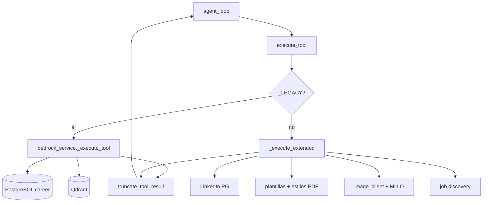
```mermaid
flowchart TD
    LOOP[agent_loop] --> EX[execute_tool]
    EX --> LEG{_LEGACY?}
    LEG -->|sí| SVC[bedrock_service._execute_tool]
    LEG -->|no| EXT[_execute_extended]
    SVC --> TR[truncate_tool_result]
    EXT --> TR
    TR --> LOOP
    EXT --> LI[LinkedIn PG]
    EXT --> PDF[plantillas + estilos PDF]
    EXT --> IMG[image_client + MinIO]
    EXT --> JOB[job discovery]
    SVC --> PG[(PostgreSQL career)]
    SVC --> QD[(Qdrant)]
```

---

## Nivel 3 — `all_tool_names`

### Recibe

Nada.

### Entrega

`set[str]` con todos los nombres de `_RAW_TOOLS`.

### Ejemplo

`{"list_career_record", "delegate_to_specialist", "generate_image", ...}`

### Flujo

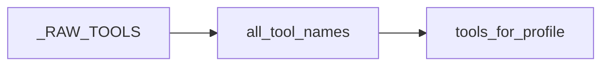
```mermaid
flowchart LR
    A[_RAW_TOOLS] --> B[all_tool_names]
    B --> C[tools_for_profile]
```

---

## Nivel 3 — `converse_tool_specs`

Convierte definiciones internas al formato `toolConfig.tools` de AWS.

### Recibe

`allowed: set[str] | None` — si se pasa, filtra por nombre.

### Entrega

Lista `[{toolSpec: {name, description, inputSchema: {json}}}]`.

### Ejemplo

`agent_digital_presence` → specs de CRUD + `delegate_to_specialist`, **sin** tools de LinkedIn ni `run_job_discovery`. Publicación LinkedIn: `agent_linkedin_publishing`.

### Flujo

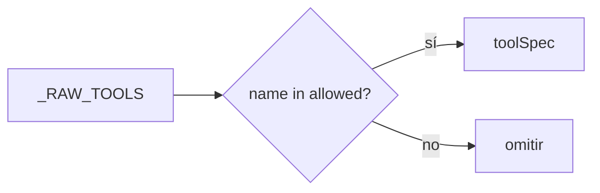
```mermaid
flowchart LR
    A[_RAW_TOOLS] --> F{name in allowed?}
    F -->|sí| S[toolSpec]
    F -->|no| X[omitir]
```

---

## Nivel 3 — `execute_tool`

Dispatcher. El loop **no** llama a repos; solo a esta función.

### Recibe

`db`, `user_id`, `name`, `tool_input`, `session_id`.

### Entrega

Dict truncado. Tool desconocida en extended → `BedrockError`.

### Ejemplo

**In:** `"list_career_record"`, `{"resource_key": "projects", "limit": 100}`  
**Out:** `{"items": [...], "total_count": 3, "has_more": false, ...}`

### Flujo

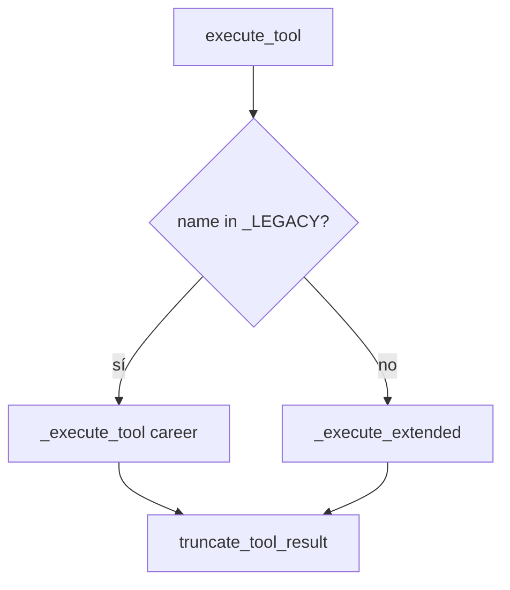
```mermaid
flowchart TD
    A[execute_tool] --> B{name in _LEGACY?}
    B -->|sí| C[_execute_tool career]
    B -->|no| D[_execute_extended]
    C --> E[truncate_tool_result]
    D --> E
```

---

## Nivel 3 — `is_write_tool`

### Recibe

`name: str`.

### Entrega

`bool` — si está en `_WRITE_TOOLS` (create/update/delete, LinkedIn, PDF, imagen, `save_job_listings`).

### Ejemplo

`is_write_tool("list_career_record")` → `False`.  
`is_write_tool("create_career_record")` → `True`.

### Flujo

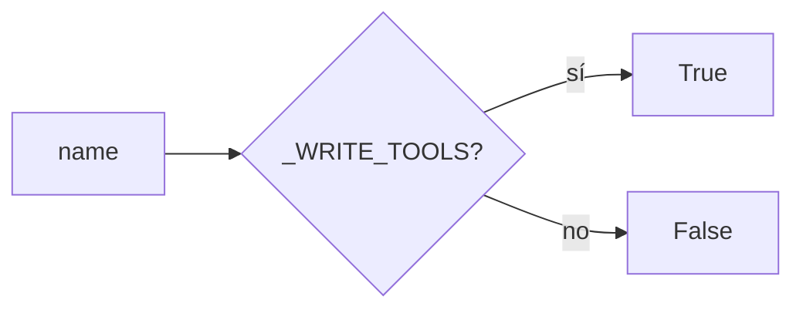
```mermaid
flowchart LR
    N[name] --> S{_WRITE_TOOLS?}
    S -->|sí| T[True]
    S -->|no| F[False]
```

---

## Nivel 3 — `invalidation_key`

Clave para que el Admin invalide caché React Query. Si el resultado trae `error`, no invalida.

### Recibe

`name`, `tool_input`, `tool_result`.

### Entrega

`str | None`: `resource_key` del input, o `"pdf-templates"` / `"pdf-template-styles"` / `"vacancies"` según `pdf_template` / `pdf_style` / `save_job_listings`.

### Ejemplo

`list_career_record` con `resource_key=projects` y resultado OK → `"projects"`.  
Tool con `{"error": "..."}` → `None`.

### Flujo

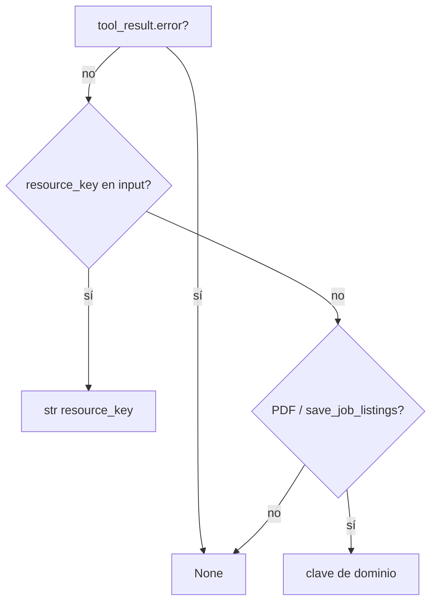
```mermaid
flowchart TD
    A[tool_result.error?] -->|sí| N[None]
    A -->|no| B{resource_key en input?}
    B -->|sí| K[str resource_key]
    B -->|no| C{PDF / save_job_listings?}
    C -->|sí| D[clave de dominio]
    C -->|no| N
```

---

# Nivel 2 — `history_manager.py`

Fuente de verdad del chat en PostgreSQL (`bedrock_conversations`, `bedrock_conversation_messages`; [modelos](../../models/README.md), [esquema](../../../docs/DATABASE.md)). Converse solo ve una **ventana de texto**; los `toolUse`/`toolResult` de la ronda actual viven en memoria del loop, no se persisten.

**Lee también:** [GET/PUT/DELETE conversaciones](../../../docs/sections/bedrock/README.md)

### Recibe

`user_id` + `session_id` (+ mensaje para título, `window` para recorte).

### Entrega

Filas ORM, o lista de mensajes formato Converse `[{role, content: [{text}]}]`.

### Ejemplo

Primera visita a `conv-proyectos-01` crea la fila con título `"Lista mis proyectos publicados"`. Turnos siguientes reutilizan la misma conversación.

### Flujo

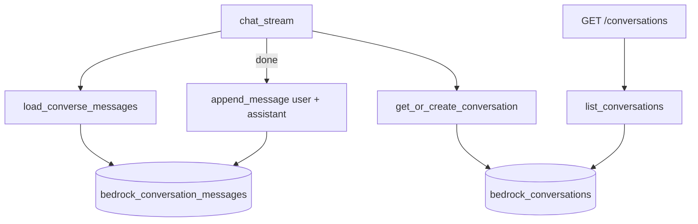
```mermaid
flowchart TD
    LOOP[chat_stream] --> LOAD[load_converse_messages]
    LOAD --> PG[(bedrock_conversation_messages)]
    LOOP --> GOC[get_or_create_conversation]
    GOC --> CONV[(bedrock_conversations)]
    LOOP -->|done| APP[append_message user + assistant]
    APP --> PG
    UI[GET /conversations] --> LIST[list_conversations]
    LIST --> CONV
```

---

## Nivel 3 — `conversation_title_from`

### Recibe

Texto del primer mensaje.

### Entrega

Hasta 60 caracteres + `…` si hace falta, o `"Nueva conversación"`.

### Ejemplo

`"Lista mis proyectos publicados y dime cuáles están en draft"` → `"Lista mis proyectos publicados y dime cuáles están e…"`.

### Flujo

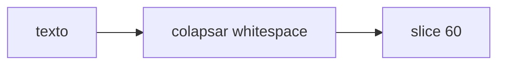
```mermaid
flowchart LR
    T[texto] --> C[colapsar whitespace]
    C --> S[slice 60]
```

---

## Nivel 3 — `get_or_create_conversation`

### Recibe

`db`, `user_id`, `session_id`, `first_message`, `session_type` (`contextual` | `general`), `agent_profile_id` (id del especialista resuelto, p. ej. `agent_professional_identity`).

### Entrega

Instancia `BedrockConversation` (existente o nueva, con commit).

### Ejemplo

Mismo `session_id` en el segundo turno → la misma fila; no duplica.

### Flujo

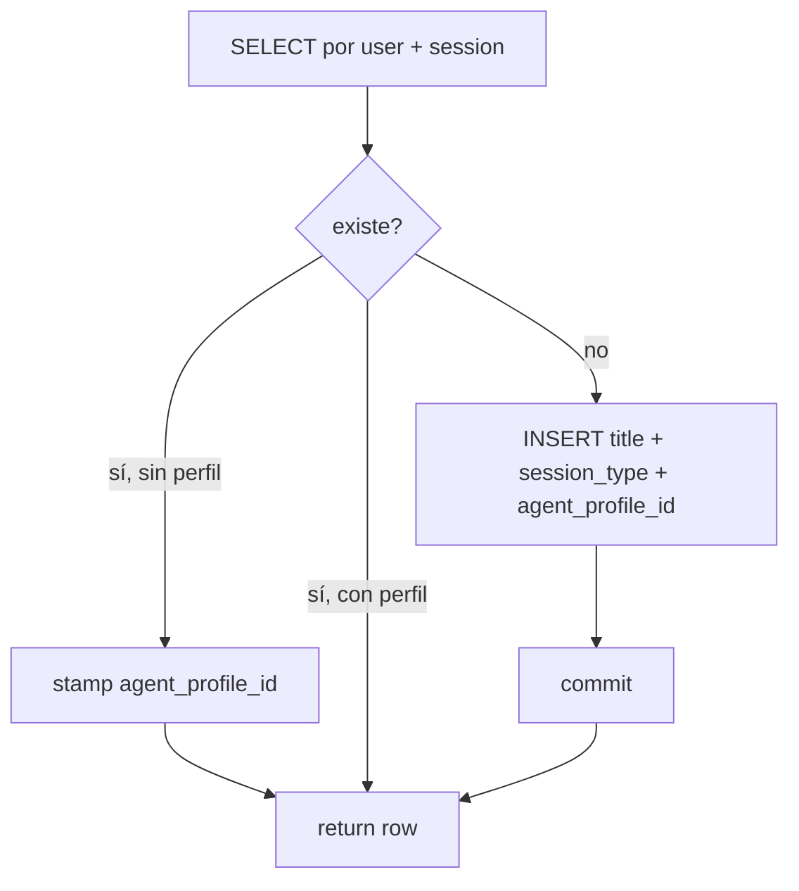
```mermaid
flowchart TD
    Q[SELECT por user + session] --> H{existe?}
    H -->|sí, sin perfil| S[stamp agent_profile_id]
    S --> R[return row]
    H -->|sí, con perfil| R
    H -->|no| N[INSERT title + session_type + agent_profile_id]
    N --> C[commit]
    C --> R
```

---

## Nivel 3 — `append_message`

### Recibe

`db`, `conversation`, `role` (`user`|`assistant`), `content` (texto visible).

### Entrega

`None` (side effect: INSERT + commit).

### Ejemplo

Al `done`: primero el mensaje del usuario, luego el `reply` del asistente. No se guardan JSON de tools.

### Flujo

```mermaid
flowchart LR
    A[role + content] --> I[INSERT message]
    I --> C[commit]
```

---

## Nivel 3 — `load_converse_messages`

Carga los últimos `window` mensajes como historial Converse. El texto del assistant pasa por `sanitize_assistant_reply`.

### Recibe

`db`, `user_id`, `session_id`, `window` (de runtime settings, p. ej. 20).

### Entrega

Lista Converse. Sin conversación → `[]`.

### Ejemplo

```python
[
  {"role": "user", "content": [{"text": "Lista mis proyectos"}]},
  {"role": "assistant", "content": [{"text": "Tienes 3 proyectos..."}]},
]
```

El loop concatena el mensaje actual **después** de esta lista.

### Flujo

```mermaid
flowchart TD
    A[buscar conversación] -->|no| E["[]"]
    A -->|sí| B[mensajes ASC]
    B --> C[slice -window]
    C --> D[sanitizar assistant]
    D --> F[formato Converse]
```

---

## Nivel 3 — `list_conversations`

### Recibe

`db`, `user_id`, `session_type` opcional, `agent_profile_id` opcional (coincidencia exacta).

### Entrega

Lista de `BedrockConversation` ordenada por `updated_at` desc. Usada por [`GET /bedrock/conversations`](../../../docs/sections/bedrock/README.md).

### Ejemplo

`session_type="contextual"` + `agent_profile_id="agent_professional_identity"` → solo chats del especialista de Identidad. Sin `agent_profile_id` → todas las del tipo. Filas con `agent_profile_id` NULL no salen en listas filtradas por agente.

### Flujo

```mermaid
flowchart LR
    F[filtro user + tipo + perfil] --> O[ORDER BY updated_at DESC]
```

---

# Nivel 2 — `agent_profiles.py`

Config **estática** de perfiles en 3 niveles (`AgentProfile.level`). Espejo user-facing: `admin/src/config/agentProfiles.ts`. Decide *quién* responde, *qué tools* puede usar y *a quién* puede delegar.

**Lee también:** [GET/PUT agent-profiles](../../../docs/sections/bedrock/README.md) · [ADR-012](../../../../docs/09-DECISIONS/012-bedrock-three-level-agents.md) · [ADR-013](../../../../docs/09-DECISIONS/013-l3-web-and-github-agents.md)

**L1:** `agent_orchestrator` (solo `delegate_to_specialist`).
**L2:** `agent_professional_identity`, `agent_search_operations`, `agent_digital_presence`, `agent_networking`, `agent_support`, `agent_methodologies`, `agent_pdf_design`.
**L3 (sin chat):** `agent_pdf_render`, `agent_visual_design`, `agent_changelog`, `agent_task_manager`, `agent_linkedin_publishing`, `agent_vacancy_search`, `agent_cv_writing`, `agent_cover_letter_writing`, `agent_web_search`, `agent_github`.

### Recibe

`chat_surface`, `agent_profile_id` opcional, `page_context` opcional.

### Entrega

Un `AgentProfile` (tools, suffix, modelo default, flags `write_enabled` / `can_delegate`).

### Ejemplo

Contextual + `resource_key=projects` → perfil `agent_professional_identity`.  
`chat_surface=general` → siempre `agent_orchestrator`. Contextual → L2 de la ruta/`resource_key`. L3 nunca es agente principal de un chat de usuario.

### Flujo

```mermaid
flowchart TD
    IN[superficie + contexto] --> R[resolve_agent_profile]
    R --> P[AgentProfile]
    P --> T[tools_for_profile]
    T --> SPECS[converse_tool_specs]
    P --> SUF[profile_prompts.get_effective_suffix]
```

---

## Nivel 3 — `AgentProfile`

Dataclass frozen: `id`, `label`, `level` (1|2|3), `domain_keys`, `resource_keys`, `methodology_sections`, `system_prompt_suffix`, `default_model_id`, `allowed_tool_names`, `write_enabled`. Propiedades: `can_delegate` (L1/L2), `user_facing` (L1/L2).

### Recibe / Entrega

No es una función: es el valor que circula por el loop. `resource_keys=None` = todos los recursos. Delegación: L1→L2|L3, L2→L3, L3 nadie.

### Ejemplo

`agent_visual_design.allowed_tool_names` incluye `generate_image` y no incluye `run_job_discovery`.

### Flujo

```mermaid
flowchart LR
    ID[profile id] --> GET[get_profile]
    GET --> AP[AgentProfile]
```

---

## Nivel 3 — `get_profile` / `list_profiles`

### Recibe

`get_profile(profile_id)` / `list_profiles()` sin args.

### Entrega

Un perfil o la lista completa. ID desconocido → `KeyError` (la ruta lo mapea a 404).

### Ejemplo

`get_profile("agent_digital_presence")` → perfil con LinkedIn + publicaciones.

### Flujo

```mermaid
flowchart LR
    ID[profile_id] --> M{_PROFILES?}
    M -->|sí| P[AgentProfile]
    M -->|no| E[KeyError]
```

---

## Nivel 3 — `resolve_agent_profile`

Router de especialista.

### Recibe

`chat_surface`, `agent_profile_id`, `page_context`.

### Entrega

`AgentProfile`. Fallback: `agent_orchestrator`.

### Ejemplo

`chat_surface="general"` ignora la página y el `agent_profile_id`.  
Contextual con `route="/linkedin"` → `agent_digital_presence`.  
Contextual con `resource_key="achievements"` → `agent_professional_identity`.

> feature 001: el turno de chat **contextual** ya no pasa por aquí. Lo resuelve
> `section_catalog.resolve_profile_for_turn` desde el catálogo de Secciones del Admin
> (agente L2 de la sección; fallback orquestador). `resolve_agent_profile` queda para
> `general` y como utilidad de biblioteca.

### Flujo

```mermaid
flowchart TD
    A{general?} -->|sí| O[agent_orchestrator]
    A -->|no| B{agent_profile_id?}
    B -->|sí| G[get_profile]
    B -->|no| C{route en _ROUTE_TO_PROFILE?}
    C -->|sí| G
    C -->|no| D{resource_key → dominio?}
    D -->|sí| G
    D -->|no| O
```

---

## Nivel 3 — `tools_for_profile`

Filtra el catálogo global al subset del perfil.

### Recibe

`profile`, `all_tool_names`.

### Entrega

`set[str]`. L1 = solo `delegate_to_specialist`. L2 = CRUD de dominio + delegate a L3. L3 = tools de su tarea, sin delegate.

### Ejemplo

`agent_professional_identity` no recibe `create_linkedin_post`. `agent_vacancy_search` sí recibe `run_job_discovery`; `agent_search_operations` no (delega).

### Flujo

```mermaid
flowchart TD
    A{allowed_tool_names?} -->|sí| I[intersección con catálogo]
    A -->|no| B{L1 agent_orchestrator?}
    B -->|sí| DEL[solo delegate_to_specialist]
    B -->|no| C[L2 base CRUD]
    I --> F[delegate según can_delegate]
    DEL --> F
    C --> F
```

---

# Nivel 2 — `section_profiles.py`

Elige **modelo** (no agente) según la sección del Admin. Espejo de `admin/src/config/chatSectionProfiles.ts`. Perfiles de chat: `crud_standard`, `strategy`, `narrative`, `digital_presence`, `methodology`, `read_light`, `agent_admin`, `singleton_identity`.

**Lee también:** catálogo de modelos en [BEDROCK-HARNESS.md](../../../docs/BEDROCK-HARNESS.md) y [`GET /bedrock/model`](../../../docs/sections/bedrock/README.md).

### Recibe

`page_context` (`route`, `chat_profile`, `resource_key`).

### Entrega

`model_id` string. Sin contexto → `BEDROCK_DEFAULT_MODEL_ID`.

### Ejemplo

`resource_key=vacancies` → perfil `strategy` → `deepseek.v3.2` ([vacantes](../../../docs/sections/career-search/README.md)).  
`route=/dashboard` → `read_light` → Nova Lite.

### Flujo

```mermaid
flowchart TD
    CTX[page_context] --> R[resolve_recommended_model]
    R --> M[model_id]
    M --> EFF[_effective_model]
```

---

## Nivel 3 — `resolve_recommended_model`

### Recibe

`page_context: dict | None`.

### Entrega

ID de modelo. Orden: ruta estática → `chat_profile` explícito → `resource_key` → default global.

### Ejemplo

`{"resource_key": "star-stories"}` → Claude Sonnet (`narrative`).

### Flujo

```mermaid
flowchart TD
    A{page_context?} -->|no| DEF[BEDROCK_DEFAULT_MODEL_ID]
    A -->|sí| B{route estática?}
    B -->|sí| P[_PROFILE_MODELS]
    B -->|no| C{chat_profile conocido?}
    C -->|sí| P
    C -->|no| D{resource_key mapeado?}
    D -->|sí| P
    D -->|no| DEF
```

---

# Nivel 2 — `delegation.py`

Implementa la tool `delegate_to_specialist` para L1 y L2 ([ADR-012](../../../../docs/09-DECISIONS/012-bedrock-three-level-agents.md)). El caller no ejecuta la tarea del destino: lanza un sub-turno acotado (sin historial de sesión). L2 puede anidar un hop a L3.

**Lee también:** eventos `delegation_*` en [sections/bedrock](../../../docs/sections/bedrock/README.md)

Límites (en `agent_loop`, no aquí): `can_delegate`, destinos según nivel, profundidad máxima 2, `BEDROCK_MAX_DELEGATIONS_PER_TURN`.

### Recibe

`db`, `user_id`, `session_id`, `profile`, `task`, `context` opcional.

### Entrega

`{summary, affected_resources}` para reinyectar al orquestador como `toolResult`.

### Ejemplo

Orquestador: “lista proyectos” → sub-turno `agent_professional_identity` → `summary` con los 3 proyectos, `affected_resources: ["projects"]`.

### Flujo

```mermaid
flowchart TD
    ORCH[agent_orchestrator tool_use] --> SUB[run_specialist_sub_turn]
    SUB --> SYNC["run_single_turn_sync contextual, history=False, max=4"]
    SYNC --> LOOP[chat_stream del especialista]
    LOOP --> OUT["{summary, affected_resources}"]
    OUT --> ORCH
```

---

## Nivel 3 — `run_specialist_sub_turn`

### Recibe

Keyword-only: `user_id`, `session_id`, `profile: AgentProfile`, `task`, `context`.

### Entrega

```python
{"summary": "<reply del especialista>", "affected_resources": ["projects"]}
```

El mensaje interno es `task` o `task + "\n\nContexto:\n" + context`. Usa `profile.default_model_id`. **No** escribe en el historial de la sesión (el orquestador sí lo hará al final).

### Ejemplo

```python
await run_specialist_sub_turn(
    db, user_id=uid, session_id=sid,
    profile=get_profile("agent_digital_presence"),
    task="Listar proyectos publicados",
    context="El usuario está en /career/projects",
)
```

### Flujo

```mermaid
flowchart TD
    T[task + context] --> S[run_single_turn_sync]
    S --> D[done.reply]
    D --> R[summary + affected_resources]
```

---

# Nivel 2 — `budget.py`

Tope diario USD por usuario (ventana **UTC**). Suma `bedrock_usage_logs` + `bedrock_usage_round_logs` ([modelos](../../models/README.md)). El límite sale de PG (`bedrock_settings.daily_budget_usd`) o de `BEDROCK_DAILY_BUDGET_USD` ([SETUP](../../../docs/SETUP.md)).

**Lee también:** [`GET /bedrock/budget` y usage-metrics](../../../docs/sections/bedrock/README.md)

Si el gasto ya cubrió el tope, **no hay inferencia**: `assert_budget_available` lanza antes del primer `yield` de `chat_stream`. La ruta convierte eso en SSE `error`.

### Recibe

`db`, `user_id`, `daily_budget`.

### Entrega

`float` de gasto/saldo, o excepción `BedrockBudgetExceeded`.

### Ejemplo

Gastados $5.00 / tope $5.00 → error `"Presupuesto diario agotado ($5.00 / $5.00)..."`.

### Flujo

```mermaid
flowchart TD
    LOOP[chat_stream] --> A[assert_budget_available]
    A --> S[get_daily_spend_usd]
    S --> PG[(usage logs)]
    S -->|spent >= budget| X[BedrockBudgetExceeded]
    S -->|ok| LOOP2[continuar turno]
    API[GET /bedrock/budget] --> R[get_remaining_budget_usd]
```

---

## Nivel 3 — `get_daily_spend_usd`

### Recibe

`db`, `user_id`.

### Entrega

`float` — suma de costos estimados desde `00:00 UTC`.

### Ejemplo

Turno $0.012 + round logs $0.003 → `0.015`.

### Flujo

```mermaid
flowchart LR
    T[today UTC] --> L1[SUM usage_logs]
    T --> L2[SUM round_logs]
    L1 --> SUM[total]
    L2 --> SUM
```

---

## Nivel 3 — `assert_budget_available`

### Recibe

`db`, `user_id`, `daily_budget`.

### Entrega

`None` o `BedrockBudgetExceeded`.

### Ejemplo

`spent=5.0`, `daily_budget=5.0` → excepción. `spent=1.2`, `budget=5.0` → pasa.

### Flujo

```mermaid
flowchart TD
    S[spent] --> C{spent >= budget?}
    C -->|sí| E[raise BedrockBudgetExceeded]
    C -->|no| OK[return]
```

---

## Nivel 3 — `get_remaining_budget_usd`

### Recibe

`db`, `user_id`, `daily_budget`.

### Entrega

`max(0.0, budget - spent)`. Nunca negativo.

### Ejemplo

Tope 5.0, gastado 1.25 → `3.75`.

### Flujo

```mermaid
flowchart LR
    B[budget] --> SUB[budget - spent]
    SUB --> MAX[max 0]
```

---

# Nivel 2 — `usage_logger.py`

Auditoría de tokens y costo **best-effort**: si el INSERT falla, el chat no se cae. Usa sesión propia (`AsyncSessionLocal`), no la del request.

**Lee también:** [`GET /bedrock/usage-metrics`](../../../docs/sections/bedrock/README.md) · tarifas en [BEDROCK-HARNESS.md](../../../docs/BEDROCK-HARNESS.md) · [modelos usage](../../models/README.md)

Precios de `BEDROCK_AVAILABLE_MODELS` (`price_input/output_per_million`). Imágenes pueden usar `fixed_cost_usd`.

### Recibe

`user_id`, `session_id`, `model_id`, `usage` `{inputTokens, outputTokens}`, más metadatos de round.

### Entrega

`None` (side effect en PG).

### Ejemplo

Ronda Converse 1840 in / 62 out en Nova Pro → fila en `bedrock_usage_round_logs`. Al `done`, otra fila agregada en `bedrock_usage_logs`.

### Flujo

```mermaid
flowchart TD
    CV[cada converse] --> RR[record_round_log type=converse]
    DONE[fin de turno] --> RT[record_turn_usage]
    RR --> PG1[(bedrock_usage_round_logs)]
    RT --> PG2[(bedrock_usage_logs)]
    IMG[generate_image] --> RR2[record_round_log fixed_cost]
```

---

## Nivel 3 — `_estimate_cost`

### Recibe

`model_id`, `input_tokens`, `output_tokens`.

### Entrega

`float` USD. Modelo desconocido → tarifas 0.

### Ejemplo

1000 in + 500 out a $0.80 / $3.20 por millón → `0.0008 + 0.0016 = 0.0024`.

### Flujo

```mermaid
flowchart LR
    IN[tokens] --> P[precios por millón]
    P --> USD[float]
```

---

## Nivel 3 — `record_turn_usage`

Una fila por **turno completo** (panel de costos).

### Recibe

`user_id`, `session_id`, `model_id`, `usage`.

### Entrega

`None`.

### Ejemplo

Tras el `done`, `total_usage` acumulado de todas las vueltas Converse del turno.

### Flujo

```mermaid
flowchart LR
    U[usage acumulado] --> E[_estimate_cost]
    E --> I[INSERT BedrockUsageLog]
```

---

## Nivel 3 — `record_round_log`

Granular: cada llamada Converse, delegación o imagen.

### Recibe

Keyword-only: `user_id`, `session_id`, `model_id`, `round_type`, `usage`, `tool_name`, `agent_profile_id`, `notes`, `fixed_cost_usd`.

### Entrega

`None`.

### Ejemplo

`round_type="converse"`, `agent_profile_id="agent_digital_presence"`, usage de esa ronda.

### Flujo

```mermaid
flowchart TD
    A{fixed_cost_usd?} -->|sí| C[usar fijo]
    A -->|no| E[_estimate_cost]
    C --> I[INSERT round log]
    E --> I
```

---

# Nivel 2 — `prompt.py`

Ensambla el **system prompt** de cada turno (no se cachea: un edit en Admin aplica en el siguiente mensaje).

**Lee también:** [`GET/PUT /bedrock/instructions`](../../../docs/sections/bedrock/README.md) · [fachada `default_system_prompt`](../README.md) · regla de vacantes en [job-discovery](../../../docs/sections/job-discovery/README.md)

Capas, en orden:

1. Override PG (`bedrock_settings.system_prompt`) o default de `bedrock_service`
2. `GROUNDING_RULE` (no alucinar datos de carrera; usar tools)
3. Suffix del perfil (`profile_prompts.get_effective_suffix`)
4. Contexto de página si hay `resource_key`
5. `JOB_DISCOVERY_AUTH_RULE` si perfil `agent_search_operations` / `agent_vacancy_search` o ruta `/job-discovery`

### Recibe

`db`, `profile: AgentProfile`, `page_context`.

### Entrega

Un `str` largo que va en `system: [{text}]` de Converse.

### Ejemplo

En Proyectos, el prompt termina con *«El usuario está en Proyectos (resource_key=projects). Prioriza operaciones sobre ese recurso…»*.

### Flujo

```mermaid
flowchart TD
    BASE[override PG o default] --> G[GROUNDING_RULE]
    G --> S[suffix efectivo]
    S --> P{resource_key?}
    P -->|sí| CTX[frase de página]
    P -->|no| J
    CTX --> J{agent_search_operations / agent_vacancy_search / job-discovery?}
    J -->|sí| JOB[JOB_DISCOVERY_AUTH_RULE]
    J -->|no| OUT[join \n\n]
    JOB --> OUT
```

---

## Nivel 3 — `default_system_prompt`

### Recibe

Nada. Delega a `bedrock_service.default_system_prompt()` (misma fuente que `GET /bedrock/instructions`).

### Entrega

Prompt base (rol del agente, tono, reglas generales).

### Ejemplo

Texto largo de identidad del asistente de Carlos; no incluye el suffix del perfil.

### Flujo

```mermaid
flowchart LR
    A[default_system_prompt] --> B[bedrock_service.default_system_prompt]
```

---

## Nivel 3 — `get_system_prompt_override`

### Recibe

`db`.

### Entrega

`str | None` — columna `system_prompt` de `bedrock_settings` si no está vacía.

### Ejemplo

Admin hizo `PUT /bedrock/instructions` → ese texto sustituye al default en la capa 1.

### Flujo

```mermaid
flowchart TD
    Q[SELECT bedrock_settings] --> H{system_prompt?}
    H -->|sí| V[str]
    H -->|no| N[None]
```

---

## Nivel 3 — `compose_system_prompt`

### Recibe

`db`, `profile`, `page_context`, `user_id` (opcional; carga el catálogo de metodologías asignadas).

### Entrega

Prompt final concatenado. Partes vacías se omiten. Incluye la regla de metodologías asignadas al perfil y, si hay `user_id`, el catálogo vigente (títulos `opm-N`).

### Ejemplo

`compose_system_prompt(db, identity_profile, {"resource_key": "projects", "page_title": "Proyectos"}, user_id=...)` → base + grounding + catálogo de metodologías asignadas + suffix de `agent_professional_identity` + frase de página.

### Flujo

Ver diagrama del módulo (Nivel 2).

---

# Nivel 2 — `profile_catalog.py`

Catálogo del Admin (`GET /bedrock/agent-profiles/catalog`). Junta la definición de código (`tools_for_profile`, `resource_keys`, nivel) con el estado editable (prompt override, metodologías asignadas, conteo de chats).

**Lee también:** [GET catalog](../../../docs/sections/bedrock/README.md)

### Recibe

`db`, `user_id`; en detalle, `profile_id`.

### Entrega

Lista o ítem con tools, tablas, prompt, metodologías y `has_own_memory` (L1/L2).

---

# Nivel 2 — `profile_prompts.py`

Suffix **editable** por perfil (`bedrock_agent_profile_prompt`). El código estático en `agent_profiles.py` es el default; el Admin puede override con [`PUT /bedrock/agent-profiles/{id}/prompt`](../../../docs/sections/bedrock/README.md).

**Lee también:** [GET/PUT agent-profiles](../../../docs/sections/bedrock/README.md)

### Recibe

`db` + `profile` o `profile_id` + texto.

### Entrega

Suffix efectivo, o dicts para la UI (`default_suffix`, `override_suffix`, `effective_suffix`, `is_default`).

### Ejemplo

Sin override → suffix compilado del perfil `agent_digital_presence`. Con override → el texto de PG.

### Flujo

```mermaid
flowchart TD
    COMPOSE[compose_system_prompt] --> EFF[get_effective_suffix]
    EFF --> PG[(bedrock_agent_profile_prompt)]
    UI[GET/PUT agent-profiles] --> LIST[list_profile_prompts]
    UI --> SET[set_profile_prompt_suffix]
```

---

## Nivel 3 — `get_effective_suffix`

### Recibe

`db`, `profile`.

### Entrega

Override strippeado si existe y no está vacío; si no, `profile.system_prompt_suffix`.

### Ejemplo

Fila PG `"Habla siempre en español técnico."` gana sobre el suffix estático.

### Flujo

```mermaid
flowchart TD
    Q[SELECT por profile_id] --> H{suffix no vacío?}
    H -->|sí| O[override]
    H -->|no| D[profile.system_prompt_suffix]
```

---

## Nivel 3 — `list_profile_prompts`

### Recibe

`db`.

### Entrega

Lista de dicts, un ítem por perfil estático.

### Ejemplo

```python
{
  "profile_id": "agent_digital_presence",
  "label": "...",
  "default_suffix": "...",
  "override_suffix": None,
  "effective_suffix": "...",
  "is_default": True,
}
```

### Flujo

```mermaid
flowchart LR
    L[list_profiles] --> M[mapa overrides PG]
    M --> D[dict por perfil]
```

---

## Nivel 3 — `set_profile_prompt_suffix`

### Recibe

`db`, `profile_id`, `system_prompt_suffix` (`None` o vacío = restaurar default, borra la fila).

### Entrega

Mismo dict que un ítem de `list_profile_prompts`. Perfil desconocido → `KeyError`.

### Ejemplo

`PUT` con texto → UPSERT. `PUT` con `null` → DELETE override.

### Flujo

```mermaid
flowchart TD
    T{texto?} -->|no| DEL[DELETE row]
    T -->|sí y existe| UP[UPDATE]
    T -->|sí y no existe| INS[INSERT]
    DEL --> OUT[dict efectivo]
    UP --> OUT
    INS --> OUT
```

---

# Nivel 2 — `settings_loader.py`

Lee la fila única `bedrock_settings` y la fusiona con env/`config.py`. Es la config **runtime** del harness (modelo activo, orquestador, vueltas, ventana de historial, presupuesto).

**Lee también:** [`GET/POST /bedrock/model`](../../../docs/sections/bedrock/README.md) · variables en [SETUP.md](../../../docs/SETUP.md)

### Recibe

`db` (y `model_id` al escribir).

### Entrega

`HarnessRuntimeSettings` o un `model_id`. Sin fila PG → defaults de `settings`.

### Ejemplo

Admin cambia modelo con [`POST /bedrock/model`](../../../docs/sections/bedrock/README.md) → `set_active_model_id`; el siguiente turno contextual sin override usa ese ID vía otras rutas; el loop usa `orchestrator_model_id` / defaults según `_effective_model`.

### Flujo

```mermaid
flowchart TD
    LOOP[chat_stream] --> G[get_runtime_settings]
    G --> PG[(bedrock_settings)]
    G --> ENV[config.py defaults]
    API[GET/POST /bedrock/model] --> GET[get_active_model_id]
    API --> SET[set_active_model_id]
```

---

## Nivel 3 — `HarnessRuntimeSettings`

Dataclass: `active_model_id`, `orchestrator_model_id`, `max_round_trips`, `history_window`, `daily_budget_usd`.

### Recibe / Entrega

Valor de retorno de `get_runtime_settings`. El loop usa `max_round_trips`, `history_window`, `daily_budget_usd`, `orchestrator_model_id`.

### Ejemplo

`max_round_trips=6`, `history_window=20`, `daily_budget_usd=5.0`.

### Flujo

```mermaid
flowchart LR
    ROW[fila PG o None] --> MERGE[merge con settings]
    MERGE --> DTO[HarnessRuntimeSettings]
```

---

## Nivel 3 — `get_runtime_settings`

### Recibe

`db`.

### Entrega

`HarnessRuntimeSettings` (siempre; nunca `None`).

### Ejemplo

Sin fila: todo viene de `BEDROCK_*` en env. Con fila: cada campo no nulo pisa el default.

### Flujo

```mermaid
flowchart TD
    Q[SELECT LIMIT 1] --> M[construir dataclass]
```

---

## Nivel 3 — `get_active_model_id` / `set_active_model_id`

### Recibe

Get: `db`. Set: `db` + `model_id` (ya validado por la ruta contra allow-list).

### Entrega

Get: `str`. Set: `None` (commit). Crea la fila si no existía.

### Ejemplo

`set_active_model_id(db, "amazon.nova-pro-v1:0")` persiste el modelo del panel.

### Flujo

```mermaid
flowchart TD
    GET[get_active_model_id] --> RS[get_runtime_settings]
    SET[set_active_model_id] --> Q{fila?}
    Q -->|no| I[INSERT]
    Q -->|sí| U[UPDATE active_model_id]
    I --> C[commit]
    U --> C
```

---

# Nivel 2 — `attachments.py`

Convierte adjuntos del chat en **content blocks** Converse. Valida que el `file_id` exista, esté activo y pertenezca al usuario; baja bytes de [MinIO](../../../docs/sections/files/README.md) (`storage_service` en [services](../README.md)).

**Lee también:** [sections/files](../../../docs/sections/files/README.md) · modelo `file_upload` en [models](../../models/README.md)

Límites: 5 MB. Imágenes `png/jpeg/gif/webp`; documentos `pdf/txt/md`; otros → URL en el texto.

### Recibe

`db`, `user_id`, `message`, `attachments: [{file_id}] | None`.

### Entrega

Lista de bloques Converse. File missing / demasiado grande → `BedrockError`.

### Ejemplo

Mensaje + PNG → `[{"text": "mira esto\n\n[Adjunto: shot.png] (imagen incluida)"}, {"image": {"format": "png", "source": {"bytes": b"..."}}}]`.

### Flujo

```mermaid
flowchart TD
    MSG[message] --> TXT[text_parts]
    ATT[attachments] --> FID[file_id]
    FID --> DB[(file_uploads)]
    DB --> MINIO[storage_service.get_object_stream]
    MINIO --> MIME{tipo?}
    MIME -->|image| IMG[bloque image]
    MIME -->|pdf/txt/md| DOC[bloque document]
    MIME -->|otro| URL[texto con URL]
    TXT --> BLOCKS[insert text al inicio]
    IMG --> BLOCKS
    DOC --> BLOCKS
```

---

## Nivel 3 — `build_user_content_blocks`

Única función pública del módulo.

### Recibe

Ver Nivel 2.

### Entrega

`List[dict]` listo para `messages[-1].content`. Sin texto ni adjuntos útiles → `[{"text": message or ""}]`.

### Ejemplo

`attachments=None` → `[{"text": "Lista mis proyectos publicados"}]`.

### Flujo

Ver diagrama del módulo (Nivel 2).

---

# Nivel 2 — `image_client.py`

Cliente Bedrock Stability **Stable Image Core** (`invoke_model`, **no** Converse;
región `BEDROCK_IMAGE_REGION=us-west-2`, separada de `BEDROCK_REGION` que sirve
Converse/embeddings). Reemplaza a Titan Image Generator (v1/v2 llegaron a EOL) y a
Nova Canvas (sin acceso habilitado en esta cuenta) — ver ADR-025, spec 002.
`tools.generate_image` toma los PNG bytes, los sube a
[MinIO](../../../docs/sections/files/README.md) y registra el asset.

**Lee también:** [sections/files](../../../docs/sections/files/README.md)

### Recibe

`prompt`, `aspect_ratio` (uno de los valores fijos que acepta el modelo — `1:1`,
`16:9`, etc. — calculado por `image_pipeline.stability_aspect_ratio` a partir del
`PurposeSpec` de cada `purpose`; el recorte a la medida exacta lo hace después
`finalize_png`).

### Entrega

`bytes` PNG. Fallo AWS → `BedrockError` (mensaje incluye `modelId` y región).

### Ejemplo

Prompt `"banner cyan profesional para publicación de proyecto"` → PNG que la tool guarda y devuelve `image_url`.

### Flujo

```mermaid
flowchart TD
    TOOL[tools.generate_image] --> GEN[generate_image_bytes]
    GEN --> AWS[invoke_model Stable Image Core]
    AWS --> B64[decode images 0]
    B64 --> PNG[bytes]
    PNG --> MINIO[upload]
```

**Delegación (RF-011/RF-012):** quien delega a `agent_visual_design` DEBE declarar
el `purpose` explícito según su dominio (`agent_professional_identity` →
`proyectos`, `agent_digital_presence` → `publicaciones`, `agent_configuration` →
`agentes`); el agente Visual no adivina — si no viene claro, pregunta antes de
generar (`delegate_to_specialist` es de un solo golpe, sin ida y vuelta L2↔L3).

**Readiness (RF-008):** `GET /system/readiness` (separado de `/health`) confirma
que las credenciales configuradas autentican contra MinIO
(`storage_service.check_connection`) — detecta una desincronización antes de que
falle un upload real.

---

## Nivel 3 — `generate_image_bytes`

### Recibe

`prompt: str`, `aspect_ratio: str`.

### Entrega

`bytes`. Body AWS: `{"prompt", "aspect_ratio", "output_format": "png"}` (formato
Stability, no Titan).

### Ejemplo

`await generate_image_bytes("icono de API REST, fondo oscuro", aspect_ratio="1:1")`.

### Flujo

```mermaid
flowchart LR
    P[prompt] --> I[invoke_model]
    I --> J[JSON images 0]
    J --> D[base64 decode]
```

---

# Nivel 2 — `embeddings.py`

Vectoriza texto con Titan Embeddings v2 (`invoke_model`, no Converse). Lo usan `search_knowledge_base` y `local_memory`.

**Lee también:** [Qdrant en infrastructure](../../../docs/sections/infrastructure/README.md) · [`GET /bedrock/knowledge/search`](../../../docs/sections/bedrock/README.md)

### Recibe

Texto plano.

### Entrega

`List[float]` (vector). Sin AWS → `BedrockError`. Fallo de invoke → `BedrockError("Embedding failed: ...")`.

### Ejemplo

`"proyectos de automatización industrial"` → vector ~1024 dims para `qdrant_service.search`.

### Flujo

```mermaid
flowchart TD
    Q[query] --> E[embed_text]
    E --> AWS[invoke_model Titan Embed]
    AWS --> V[embedding]
    V --> QD[qdrant search / upsert]
```

---

## Nivel 3 — `embed_text`

### Recibe

`text: str`. Body: `{"inputText": text}`.

### Entrega

`payload["embedding"]`.

### Ejemplo

Usado por `GET /bedrock/knowledge/search?q=...` y por la tool `search_knowledge_base`.

### Flujo

```mermaid
flowchart LR
    T[text] --> C[_get_embedding_client]
    C --> I[invoke_model]
    I --> V[list float]
```

---

# Nivel 2 — `local_memory.py`

Dos almacenes:

- **Corto plazo:** mensajes de una conversación en PG (formato UI “eventos”).
- **Largo plazo:** hechos semánticos en [Qdrant](../../../docs/sections/infrastructure/README.md) (carrera indexada + memoria manual).

No es el historial que ve Converse (eso es `history_manager`); es la API de memoria del Admin.

**Lee también:** [Memoria y conocimiento](../../../docs/sections/bedrock/README.md)

### Recibe

`user_id` + `session_id` o `query` / `text`.

### Entrega

Listas de eventos/records, o `None` al indexar. Texto vacío en manual → `BedrockError`.

### Ejemplo

[`POST /bedrock/memory/manual`](../../../docs/sections/bedrock/README.md) `{"text": "Prefiero vacantes remotas en México"}` → punto Qdrant `manual_memory` buscable después.

### Flujo

```mermaid
flowchart TD
    UI1[GET memory/events] --> EV[list_memory_events]
    EV --> PG[(messages)]
    UI2[GET memory/records] --> RET[retrieve_memory_records]
    RET --> EMB[embed_text]
    EMB --> QD[(Qdrant)]
    UI3[POST memory/manual] --> MAN[create_manual_memory]
    MAN --> EMB
    MAN --> QD
```

---

## Nivel 3 — `list_memory_events`

### Recibe

`db`, `user_id`, `session_id`, `max_results=50`.

### Entrega

Lista `{eventId, eventTimestamp, payload: [{conversational: {role, content}}]}`. Sin conversación → `[]`.

### Ejemplo

Misma sesión de chat, roles `USER` / `ASSISTANT` en mayúsculas (formato UI).

### Flujo

```mermaid
flowchart TD
    C[buscar conversación] -->|no| E["[]"]
    C -->|sí| M[mensajes ASC limit]
    M --> F[map a eventos]
```

---

## Nivel 3 — `retrieve_memory_records`

### Recibe

`user_id`, `query`, `top_k=10`.

### Entrega

```python
[{"memoryRecordId": "projects:1", "content": {"text": "..."}, "score": 0.81, "namespaces": ["career_record", "projects"]}]
```

### Ejemplo

Query `"preferencias de vacantes"` → hits de Qdrant (carrera + `manual_memory`).

### Flujo

```mermaid
flowchart LR
    Q[query] --> V[embed_text]
    V --> S[qdrant_service.search]
    S --> MAP[map a memory records]
```

---

## Nivel 3 — `create_manual_memory`

### Recibe

`user_id`, `text`.

### Entrega

`None`. `record_id` derivado de SHA-256 del texto (estable para re-upsert).

### Ejemplo

Texto en blanco → `BedrockError("El texto de memoria no puede estar vacío")`.

### Flujo

```mermaid
flowchart TD
    T[strip text] -->|vacío| E[BedrockError]
    T --> H[hash record_id]
    H --> V[embed_text]
    V --> U[qdrant upsert manual_memory]
```

---

# Nivel 2 — `reply_text.py`

Quita markup de chain-of-thought (`<thinking>` / `<think>`) que algunos modelos meten en el bloque `text` de Converse. Se aplica al parsear AWS y al cargar historial assistant, para que el usuario nunca vea el razonamiento interno.

### Recibe

Texto crudo del modelo.

### Entrega

Texto visible. Si *todo* el reply estaba dentro de tags, conserva el interior sin tags.

### Ejemplo

`"<thinking>voy a listar</thinking>\nTienes 3 proyectos"` → `"Tienes 3 proyectos"`.

### Flujo

```mermaid
flowchart LR
    AWS[bloque text] --> S[sanitize_assistant_reply]
    S --> UI[reply / historial]
    PG[mensaje assistant en PG] --> S
```

---

## Nivel 3 — `sanitize_assistant_reply`

### Recibe

`text: str`. Vacío → `""`.

### Entrega

`str` sin bloques think; strip final.

### Ejemplo

Tags sin cerrar: se recorta desde `<thinking>` hasta el final si no hay cierre.

### Flujo

```mermaid
flowchart TD
    T[text] --> B[quitar bloques cerrados]
    B --> U[quitar think sin cierre]
    U --> C{queda texto?}
    C -->|sí| OUT[strip]
    C -->|no| TAG[quitar tags sueltos del original]
```

---

# Nivel 2 — `tool_results.py`

Tope de caracteres del JSON que vuelve al modelo (`BEDROCK_MAX_TOOL_RESULT_CHARS`). Evita reventar la ventana de contexto con un `list_career_record` enorme.

### Recibe

Dict resultado de la tool.

### Entrega

El mismo dict, o `{truncated: True, preview, message}`.

### Ejemplo

Listado de 200 vacantes que supera el límite → el modelo ve un preview y la instrucción de filtrar más.

### Flujo

```mermaid
flowchart TD
    EX[execute_tool] --> TR[truncate_tool_result]
    TR --> LOOP[toolResult hacia Converse]
```

---

## Nivel 3 — `truncate_tool_result`

### Recibe

`result: dict`, `limit: int | None = None`. `limit` por defecto =
`BEDROCK_MAX_TOOL_RESULT_CHARS` (8000). `execute_tool` pasa
`BEDROCK_MAX_METHODOLOGY_RESULT_CHARS` (24000) cuando la llamada es
`get_career_record` sobre `operational-methodologies` — leer una metodología entera vale
su coste (spec 003 Bloque J). `search_knowledge_base type=methodology` NO llega aquí con
texto grande: devuelve extractos (`_methodology_snippet`, `excerpt` ≤ 800 chars) para que
el agente elija cuál leer entera.

### Entrega

Dict original o dict truncado. Serializa con `ensure_ascii=False` para medir longitud real.

### Ejemplo

`len(json) <= limit` → identidad. Si no:

```python
{"truncated": True, "preview": "<primeros N-80 chars>", "message": "Resultado truncado a ... Usa filtros más específicos."}
```

### Flujo

```mermaid
flowchart TD
    J[json.dumps] --> C{len <= limit?}
    C -->|sí| R[result original]
    C -->|no| T[truncated + preview]
```

---

# Nivel 2 — `errors.py`

Excepciones del harness y traductor de `botocore.ClientError` a mensajes accionables (IAM, modelo no habilitado, historial Converse inválido).

**Lee también:** [BEDROCK-HARNESS.md](../../../docs/BEDROCK-HARNESS.md) (IAM, códigos AWS) · mapeo HTTP en [sections/bedrock](../../../docs/sections/bedrock/README.md) y [routes](../../routes/README.md)

`BedrockError` es la clase que rutas y `run_single_turn_sync` convierten en HTTP 502/400 o SSE `error`. `BedrockBudgetExceeded` hereda de ella.

### Recibe

Excepción boto3 + `model_id` (en el formatter).

### Entrega

`str` legible, o tipos de excepción para `raise`.

### Ejemplo

`AccessDeniedException` en `InvokeModel` → texto que nombra la action IAM y las regiones `us-east-1/2`, `us-west-2`.

### Flujo

```mermaid
flowchart TD
    AWS[ClientError] --> FMT[format_bedrock_client_error]
    FMT --> BE[BedrockError]
    BE --> LOOP["yield error"]
    BUD[assert_budget] --> BBE[BedrockBudgetExceeded]
    BBE --> ROUTE[SSE error en routes/bedrock.py]
```

---

## Nivel 3 — `BedrockError` / `BedrockBudgetExceeded`

### Recibe

Mensaje `str` al construir.

### Entrega

Excepción. Budget es subtipo para distinguir “se acabó el dinero” de “falló AWS”.

### Ejemplo

`raise BedrockError("Missing AWS credentials")` en el cliente runtime.

### Flujo

```mermaid
flowchart LR
    BBE[BedrockBudgetExceeded] --> BE[BedrockError]
    BE --> EX[Exception]
```

---

## Nivel 3 — `format_bedrock_client_error`

### Recibe

`exc`, `model_id`.

### Entrega

Mensaje según `Error.Code`: `AccessDeniedException`, `ValidationException` (historial que no empieza en user), `ResourceNotFoundException`, u otro código; si no es `ClientError`, `"Converse request failed: ..."`.

### Ejemplo

Modelo no habilitado en la cuenta → *«Modelo Bedrock no disponible o no habilitado: 'amazon.nova-pro-v1:0'...»*.

### Flujo

```mermaid
flowchart TD
    E{ClientError?} -->|no| G[Converse request failed]
    E -->|sí| C{Code}
    C -->|AccessDenied| IAM[mensaje IAM + action]
    C -->|Validation| VAL[historial o validación]
    C -->|ResourceNotFound| MOD[modelo no habilitado]
    C -->|otro| RAW[Error code + message]
```

---

# Nivel 2 — `__init__.py`

API pública del paquete. El resto de módulos se importan por path interno (`services.bedrock.history_manager`, etc.) o desde [`bedrock_service.py`](../README.md) / [rutas](../../routes/README.md).

**Lee también:** [tests unitarios](../../../tests/unit/bedrock/README.md)

### Recibe

Nada en runtime (solo reexporta).

### Entrega

```python
__all__ = ["chat_stream", "BedrockError", "BedrockBudgetExceeded"]
```

### Ejemplo

```python
from services.bedrock import chat_stream, BedrockError
```

equivale a importar `agent_loop.chat_stream` y `errors.*`.

### Flujo

```mermaid
flowchart LR
    PUB[from services.bedrock import chat_stream] --> INIT[__init__.py]
    INIT --> LOOP[agent_loop.chat_stream]
    PUB2[BedrockError] --> ERR[errors.py]
```
